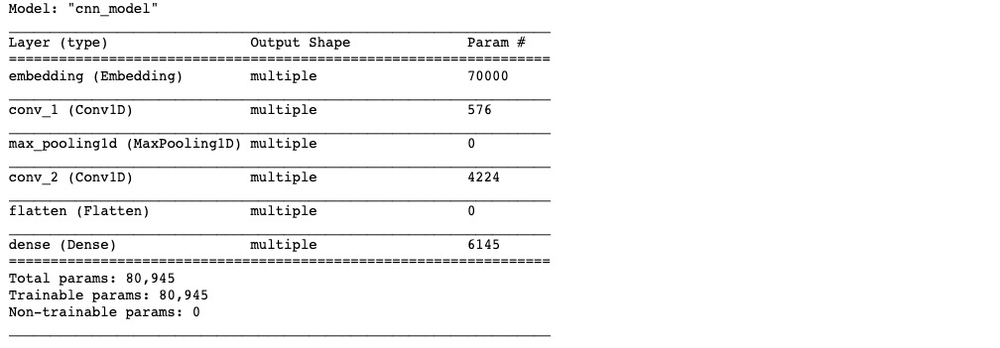

# 1-3,文本数据建模流程范例


### 一，准备数据


imdb数据集的目标是根据电影评论的文本内容预测评论的情感标签。

训练集有20000条电影评论文本，测试集有5000条电影评论文本，其中正面评论和负面评论都各占一半。

文本数据预处理较为繁琐，包括中文切词（本示例不涉及），构建词典，编码转换，序列填充，构建数据管道等等。


在tensorflow中完成文本数据预处理的常用方案有两种，第一种是利用tf.keras.preprocessing中的Tokenizer词典构建工具和tf.keras.utils.Sequence构建文本数据生成器管道。

第二种是使用tf.data.Dataset搭配tf.keras.preprocessing中的Tokenizer词典构建工具构建文本数据管道。

第一种方法较为复杂，其使用范例可以参考以下文章。

https://zhuanlan.zhihu.com/p/67697840

第二种方法更加接近TensorFlow原生方式，但也非常复杂。

我们此处介绍第二种方法。


```python
import numpy as np 
import pandas as pd 
from matplotlib import pyplot as plt
import tensorflow as tf
from tensorflow.keras import models,layers,preprocessing,optimizers,losses,metrics
from tqdm import tqdm


train_data_path = "./data/imdb/train.csv"
test_data_path =  "./data/imdb/test.csv"

train_token_path = "./data/imdb/train_token.csv"
test_token_path = "./data/imdb/test_token.csv"

MAX_WORDS = 10000  # 仅考虑最高频的10000个词
MAX_LEN = 200  # 每个样本保留200个词的长度
BATCH_SIZE = 20 

```

```python
# 统计文本行数
def linecount(file):
    count = 0
    with open(file,'r',encoding = 'utf-8') as f:
        while True:
            buffer = f.read(1024 * 1024)
            if not buffer:
                break
            count += buffer.count('\n')
    return count

train_samples = linecount(train_data_path)
test_samples = linecount(test_data_path)

```

```python
# 制作词典
def text_generator():
    with open(train_data_path,'r',encoding = 'utf-8') as f,\
    tqdm(total = train_samples) as pbar:      
        while True:
            text = (f.readline().rstrip().split('\t')[-1])
            if not text:
                break
            words = text.split(" ")
            if len(words) > MAX_LEN:
                words = words[0:MAX_LEN]
            pbar.update(1)
            yield words
            
tokenizer = preprocessing.text.Tokenizer(num_words=MAX_WORDS)            
texts = text_generator()
tokenizer.fit_on_texts(texts)

```

```python
# 单词编码
def tokenize_texts(infile,outfile,samples):
    with open(infile,encoding="utf-8") as fin, \
    open(outfile,"w",encoding="utf-8") as fout, tqdm(total = samples) as pbar:
        while True:
            data = fin.readline().rstrip()
            if not data:
                break
            label,text = data.split("\t")
            words = text.split(" ")
            wordids = preprocessing.sequence.pad_sequences(tokenizer.texts_to_sequences([words]),MAX_LEN)
            print(label+"\t"+" ".join(str(x) for x in wordids[0]),file=fout)
            pbar.update(1)
            
tokenize_texts(test_data_path,test_token_path,test_samples)
tokenize_texts(train_data_path,train_token_path,train_samples)

```

```python
# 构建管道
def parse_line(line):
    t = tf.strings.split(line,"\t")
    label = tf.reshape(tf.cast(tf.strings.to_number(t[0]),tf.int32),(-1,))
    features = tf.cast(tf.strings.to_number(tf.strings.split(t[1]," ")),tf.int32)
    return (features,label)

ds_train=  tf.data.TextLineDataset(filenames = [train_token_path]) \
   .map(parse_line,num_parallel_calls = tf.data.experimental.AUTOTUNE) \
   .shuffle(buffer_size = 1000).batch(BATCH_SIZE) \
   .prefetch(tf.data.experimental.AUTOTUNE)

ds_test=  tf.data.TextLineDataset(filenames = [test_token_path]) \
   .map(parse_line,num_parallel_calls = tf.data.experimental.AUTOTUNE) \
   .shuffle(buffer_size = 1000).batch(BATCH_SIZE) \
   .prefetch(tf.data.experimental.AUTOTUNE)

```

```python

```

### 二，定义模型


使用Keras接口有以下3种方式构建模型：使用Sequential按层顺序构建模型，使用函数式API构建任意结构模型，继承Model基类构建自定义模型。

此处选择使用继承Model基类构建自定义模型。

```python
# 演示自定义模型范例，实际上应该优先使用Sequential或者函数式API

tf.keras.backend.clear_session()

class CnnModel(models.Model):
    def __init__(self):
        super(CnnModel, self).__init__()
        
    def build(self,input_shape):
        self.embedding = layers.Embedding(MAX_WORDS,7,input_length=MAX_LEN)
        self.conv_1 = layers.Conv1D(16, kernel_size= 5,name = "conv_1",activation = "relu")
        self.pool = layers.MaxPool1D()
        self.conv_2 = layers.Conv1D(128, kernel_size=2,name = "conv_2",activation = "relu")
        self.flatten = layers.Flatten()
        self.dense = layers.Dense(1,activation = "sigmoid")
        super(CnnModel,self).build(input_shape)
    
    def call(self, x):
        x = self.embedding(x)
        x = self.conv_1(x)
        x = self.pool(x)
        x = self.conv_2(x)
        x = self.pool(x)
        x = self.flatten(x)
        x = self.dense(x)
        return(x)
    
model = CnnModel()
model.build(input_shape =(None,MAX_LEN))
model.summary()

```



```python

```

### 三，训练模型


训练模型通常有3种方法，内置fit方法，内置train_on_batch方法，以及自定义训练循环。此处我们通过自定义训练循环训练模型。

```python
#打印时间分割线
@tf.function
def printbar():
    ts = tf.timestamp()
    today_ts = ts%(24*60*60)

    hour = tf.cast(today_ts//3600+8,tf.int32)%tf.constant(24)
    minite = tf.cast((today_ts%3600)//60,tf.int32)
    second = tf.cast(tf.floor(today_ts%60),tf.int32)
    
    def timeformat(m):
        if tf.strings.length(tf.strings.format("{}",m))==1:
            return(tf.strings.format("0{}",m))
        else:
            return(tf.strings.format("{}",m))
    
    timestring = tf.strings.join([timeformat(hour),timeformat(minite),
                timeformat(second)],separator = ":")
    tf.print("=========="*8,end = "")
    tf.print(timestring)
```

```python
optimizer = optimizers.Nadam()
loss_func = losses.BinaryCrossentropy()

train_loss = metrics.Mean(name='train_loss')
train_metric = metrics.BinaryAccuracy(name='train_accuracy')

valid_loss = metrics.Mean(name='valid_loss')
valid_metric = metrics.BinaryAccuracy(name='valid_accuracy')


@tf.function
def train_step(model, features, labels):
    with tf.GradientTape() as tape:
        predictions = model(features,training = True)
        loss = loss_func(labels, predictions)
    gradients = tape.gradient(loss, model.trainable_variables)
    optimizer.apply_gradients(zip(gradients, model.trainable_variables))

    train_loss.update_state(loss)
    train_metric.update_state(labels, predictions)
    

@tf.function
def valid_step(model, features, labels):
    predictions = model(features,training = False)
    batch_loss = loss_func(labels, predictions)
    valid_loss.update_state(batch_loss)
    valid_metric.update_state(labels, predictions)


def train_model(model,ds_train,ds_valid,epochs):
    for epoch in tf.range(1,epochs+1):
        
        for features, labels in ds_train:
            train_step(model,features,labels)

        for features, labels in ds_valid:
            valid_step(model,features,labels)
        
        #此处logs模板需要根据metric具体情况修改
        logs = 'Epoch={},Loss:{},Accuracy:{},Valid Loss:{},Valid Accuracy:{}' 
        
        if epoch%1==0:
            printbar()
            tf.print(tf.strings.format(logs,
            (epoch,train_loss.result(),train_metric.result(),valid_loss.result(),valid_metric.result())))
            tf.print("")
        
        train_loss.reset_states()
        valid_loss.reset_states()
        train_metric.reset_states()
        valid_metric.reset_states()

train_model(model,ds_train,ds_test,epochs = 6)

```


### 四，评估模型


通过自定义训练循环训练的模型没有经过编译，无法直接使用model.evaluate(ds_valid)方法

```python
def evaluate_model(model,ds_valid):
    for features, labels in ds_valid:
         valid_step(model,features,labels)
    logs = 'Valid Loss:{},Valid Accuracy:{}' 
    tf.print(tf.strings.format(logs,(valid_loss.result(),valid_metric.result())))
    
    valid_loss.reset_states()
    train_metric.reset_states()
    valid_metric.reset_states()

    
```

```python
evaluate_model(model,ds_test)
```

```python

```

### 五，使用模型


可以使用以下方法:

* model.predict(ds_test)
* model(x_test)
* model.call(x_test)
* model.predict_on_batch(x_test)

推荐优先使用model.predict(ds_test)方法，既可以对Dataset，也可以对Tensor使用。

```python
model.predict(ds_test)
```

```python
for x_test,_ in ds_test.take(1):
    print(model(x_test))
    #以下方法等价：
    #print(model.call(x_test))
    #print(model.predict_on_batch(x_test))
```

```python

```

### 六，保存模型


推荐使用TensorFlow原生方式保存模型。

```python
model.save('./data/tf_model_savedmodel', save_format="tf")
print('export saved model.')

model_loaded = tf.keras.models.load_model('./data/tf_model_savedmodel')
model_loaded.predict(ds_test)
```

```python
tf.__version__
```

```python
model2 = tf.saved_model.load('./data/tf_model_savedmodel') 
for x_test,_ in ds_test.take(1):
    print(model2(x_test))
```

如果对本书内容理解上有需要进一步和作者交流的地方，欢迎在公众号"Python与算法之美"下留言。作者时间和精力有限，会酌情予以回复。


