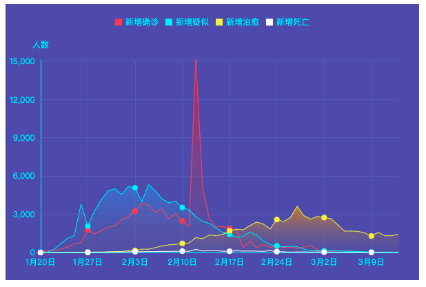
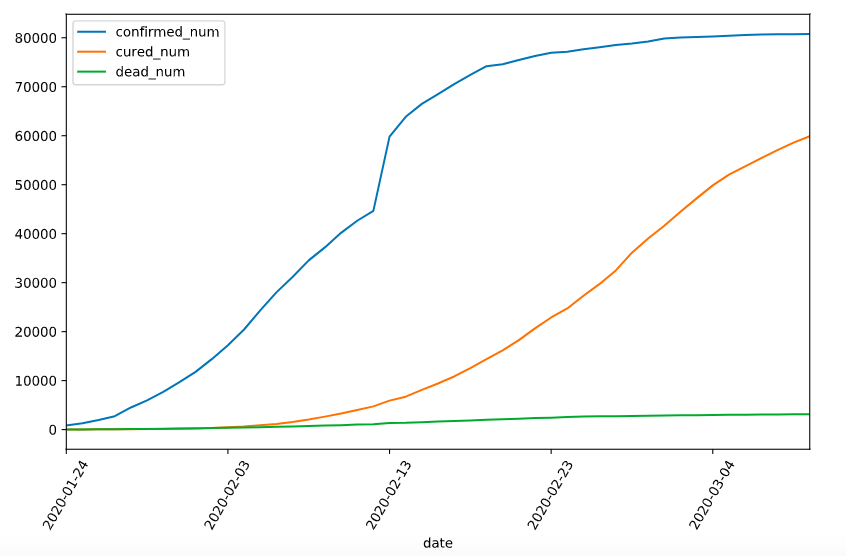
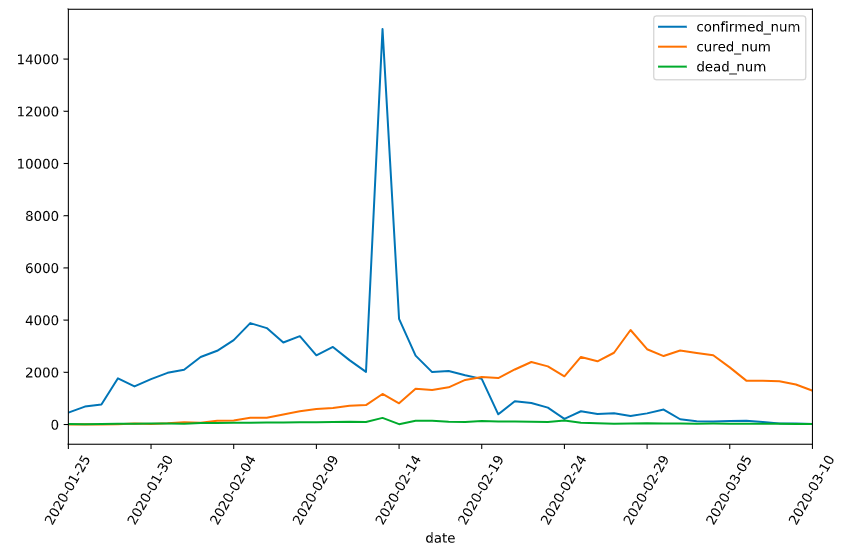
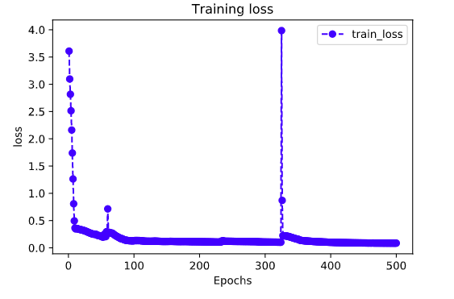
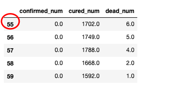
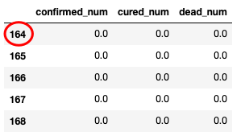
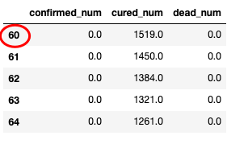

# 1-4,时间序列数据建模流程范例


国内的新冠肺炎疫情从发现至今已经持续3个多月了，这场起源于吃野味的灾难给大家的生活造成了诸多方面的影响。

有的同学是收入上的，有的同学是感情上的，有的同学是心理上的，还有的同学是体重上的。

那么国内的新冠肺炎疫情何时结束呢？什么时候我们才可以重获自由呢？

本篇文章将利用TensorFlow2.0建立时间序列RNN模型，对国内的新冠肺炎疫情结束时间进行预测。


### 一，准备数据

<!-- #region -->


本文的数据集取自tushare，数据集在本项目的 data目录下。



<!-- #endregion -->

```python
import numpy as np
import pandas as pd 
import matplotlib.pyplot as plt
import tensorflow as tf 
from tensorflow.keras import models,layers,losses,metrics,callbacks 

```

```python
%matplotlib inline
%config InlineBackend.figure_format = 'svg'

df = pd.read_csv("./data/covid-19.csv",sep = "\t")
df.plot(x = "date",y = ["confirmed_num","cured_num","dead_num"],figsize=(10,6))
plt.xticks(rotation=60)

```



```python
dfdata = df.set_index("date")
dfdiff = dfdata.diff(periods=1).dropna()
dfdiff = dfdiff.reset_index("date")

dfdiff.plot(x = "date",y = ["confirmed_num","cured_num","dead_num"],figsize=(10,6))
plt.xticks(rotation=60)
dfdiff = dfdiff.drop("date",axis = 1).astype("float32")

```



```python
#用某日前8天窗口数据作为输入预测该日数据
WINDOW_SIZE = 8

def batch_dataset(dataset):
    dataset_batched = dataset.batch(WINDOW_SIZE,drop_remainder=True)
    return dataset_batched

ds_data = tf.data.Dataset.from_tensor_slices(tf.constant(dfdiff.values,dtype = tf.float32)) \
   .window(WINDOW_SIZE,shift=1).flat_map(batch_dataset)

ds_label = tf.data.Dataset.from_tensor_slices(
    tf.constant(dfdiff.values[WINDOW_SIZE:],dtype = tf.float32))

#数据较小，可以将全部训练数据放入到一个batch中，提升性能
ds_train = tf.data.Dataset.zip((ds_data,ds_label)).batch(38).cache()


```

### 二，定义模型


使用Keras接口有以下3种方式构建模型：使用Sequential按层顺序构建模型，使用函数式API构建任意结构模型，继承Model基类构建自定义模型。

此处选择使用函数式API构建任意结构模型。

```python
#考虑到新增确诊，新增治愈，新增死亡人数数据不可能小于0，设计如下结构
class Block(layers.Layer):
    def __init__(self, **kwargs):
        super(Block, self).__init__(**kwargs)
    
    def call(self, x_input,x):
        x_out = tf.maximum((1+x)*x_input[:,-1,:],0.0)
        return x_out
    
    def get_config(self):  
        config = super(Block, self).get_config()
        return config

```

```python
tf.keras.backend.clear_session()
x_input = layers.Input(shape = (None,3),dtype = tf.float32)
x = layers.LSTM(3,return_sequences = True,input_shape=(None,3))(x_input)
x = layers.LSTM(3,return_sequences = True,input_shape=(None,3))(x)
x = layers.LSTM(3,return_sequences = True,input_shape=(None,3))(x)
x = layers.LSTM(3,input_shape=(None,3))(x)
x = layers.Dense(3)(x)

#考虑到新增确诊，新增治愈，新增死亡人数数据不可能小于0，设计如下结构
#x = tf.maximum((1+x)*x_input[:,-1,:],0.0)
x = Block()(x_input,x)
model = models.Model(inputs = [x_input],outputs = [x])
model.summary()

```

```python

```

```
Model: "model"
_________________________________________________________________
Layer (type)                 Output Shape              Param #   
=================================================================
input_1 (InputLayer)         [(None, None, 3)]         0         
_________________________________________________________________
lstm (LSTM)                  (None, None, 3)           84        
_________________________________________________________________
lstm_1 (LSTM)                (None, None, 3)           84        
_________________________________________________________________
lstm_2 (LSTM)                (None, None, 3)           84        
_________________________________________________________________
lstm_3 (LSTM)                (None, 3)                 84        
_________________________________________________________________
dense (Dense)                (None, 3)                 12        
_________________________________________________________________
block (Block)                (None, 3)                 0         
=================================================================
Total params: 348
Trainable params: 348
Non-trainable params: 0
_________________________________________________________________
```


### 三，训练模型


训练模型通常有3种方法，内置fit方法，内置train_on_batch方法，以及自定义训练循环。此处我们选择最常用也最简单的内置fit方法。

注：循环神经网络调试较为困难，需要设置多个不同的学习率多次尝试，以取得较好的效果。

```python
#自定义损失函数，考虑平方差和预测目标的比值
class MSPE(losses.Loss):
    def call(self,y_true,y_pred):
        err_percent = (y_true - y_pred)**2/(tf.maximum(y_true**2,1e-7))
        mean_err_percent = tf.reduce_mean(err_percent)
        return mean_err_percent
    
    def get_config(self):
        config = super(MSPE, self).get_config()
        return config

```

```python
import os
import datetime

optimizer = tf.keras.optimizers.Adam(learning_rate=0.01)
model.compile(optimizer=optimizer,loss=MSPE(name = "MSPE"))

stamp = datetime.datetime.now().strftime("%Y%m%d-%H%M%S")
logdir = os.path.join('data', 'autograph', stamp)

## 在 Python3 下建议使用 pathlib 修正各操作系统的路径
# from pathlib import Path
# stamp = datetime.datetime.now().strftime("%Y%m%d-%H%M%S")
# logdir = str(Path('./data/autograph/' + stamp))

tb_callback = tf.keras.callbacks.TensorBoard(logdir, histogram_freq=1)
#如果loss在100个epoch后没有提升，学习率减半。
lr_callback = tf.keras.callbacks.ReduceLROnPlateau(monitor="loss",factor = 0.5, patience = 100)
#当loss在200个epoch后没有提升，则提前终止训练。
stop_callback = tf.keras.callbacks.EarlyStopping(monitor = "loss", patience= 200)
callbacks_list = [tb_callback,lr_callback,stop_callback]

history = model.fit(ds_train,epochs=500,callbacks = callbacks_list)

```

```
Epoch 371/500
1/1 [==============================] - 0s 61ms/step - loss: 0.1184
Epoch 372/500
1/1 [==============================] - 0s 64ms/step - loss: 0.1177
Epoch 373/500
1/1 [==============================] - 0s 56ms/step - loss: 0.1169
Epoch 374/500
1/1 [==============================] - 0s 50ms/step - loss: 0.1161
Epoch 375/500
1/1 [==============================] - 0s 55ms/step - loss: 0.1154
Epoch 376/500
1/1 [==============================] - 0s 55ms/step - loss: 0.1147
Epoch 377/500
1/1 [==============================] - 0s 62ms/step - loss: 0.1140
Epoch 378/500
1/1 [==============================] - 0s 93ms/step - loss: 0.1133
Epoch 379/500
1/1 [==============================] - 0s 85ms/step - loss: 0.1126
Epoch 380/500
1/1 [==============================] - 0s 68ms/step - loss: 0.1119
Epoch 381/500
1/1 [==============================] - 0s 52ms/step - loss: 0.1113
Epoch 382/500
1/1 [==============================] - 0s 54ms/step - loss: 0.1107
Epoch 383/500
1/1 [==============================] - 0s 55ms/step - loss: 0.1100
Epoch 384/500
1/1 [==============================] - 0s 56ms/step - loss: 0.1094
Epoch 385/500
1/1 [==============================] - 0s 54ms/step - loss: 0.1088
Epoch 386/500
1/1 [==============================] - 0s 74ms/step - loss: 0.1082
Epoch 387/500
1/1 [==============================] - 0s 60ms/step - loss: 0.1077
Epoch 388/500
1/1 [==============================] - 0s 52ms/step - loss: 0.1071
Epoch 389/500
1/1 [==============================] - 0s 52ms/step - loss: 0.1066
Epoch 390/500
1/1 [==============================] - 0s 56ms/step - loss: 0.1060
Epoch 391/500
1/1 [==============================] - 0s 61ms/step - loss: 0.1055
Epoch 392/500
1/1 [==============================] - 0s 60ms/step - loss: 0.1050
Epoch 393/500
1/1 [==============================] - 0s 59ms/step - loss: 0.1045
Epoch 394/500
1/1 [==============================] - 0s 65ms/step - loss: 0.1040
Epoch 395/500
1/1 [==============================] - 0s 58ms/step - loss: 0.1035
Epoch 396/500
1/1 [==============================] - 0s 52ms/step - loss: 0.1031
Epoch 397/500
1/1 [==============================] - 0s 58ms/step - loss: 0.1026
Epoch 398/500
1/1 [==============================] - 0s 60ms/step - loss: 0.1022
Epoch 399/500
1/1 [==============================] - 0s 57ms/step - loss: 0.1017
Epoch 400/500
1/1 [==============================] - 0s 63ms/step - loss: 0.1013
Epoch 401/500
1/1 [==============================] - 0s 59ms/step - loss: 0.1009
Epoch 402/500
1/1 [==============================] - 0s 53ms/step - loss: 0.1005
Epoch 403/500
1/1 [==============================] - 0s 56ms/step - loss: 0.1001
Epoch 404/500
1/1 [==============================] - 0s 55ms/step - loss: 0.0997
Epoch 405/500
1/1 [==============================] - 0s 58ms/step - loss: 0.0993
Epoch 406/500
1/1 [==============================] - 0s 53ms/step - loss: 0.0990
Epoch 407/500
1/1 [==============================] - 0s 59ms/step - loss: 0.0986
Epoch 408/500
1/1 [==============================] - 0s 63ms/step - loss: 0.0982
Epoch 409/500
1/1 [==============================] - 0s 67ms/step - loss: 0.0979
Epoch 410/500
1/1 [==============================] - 0s 55ms/step - loss: 0.0976
Epoch 411/500
1/1 [==============================] - 0s 54ms/step - loss: 0.0972
Epoch 412/500
1/1 [==============================] - 0s 55ms/step - loss: 0.0969
Epoch 413/500
1/1 [==============================] - 0s 55ms/step - loss: 0.0966
Epoch 414/500
1/1 [==============================] - 0s 59ms/step - loss: 0.0963
Epoch 415/500
1/1 [==============================] - 0s 60ms/step - loss: 0.0960
Epoch 416/500
1/1 [==============================] - 0s 62ms/step - loss: 0.0957
Epoch 417/500
1/1 [==============================] - 0s 69ms/step - loss: 0.0954
Epoch 418/500
1/1 [==============================] - 0s 60ms/step - loss: 0.0951
Epoch 419/500
1/1 [==============================] - 0s 50ms/step - loss: 0.0948
Epoch 420/500
1/1 [==============================] - 0s 56ms/step - loss: 0.0946
Epoch 421/500
1/1 [==============================] - 0s 57ms/step - loss: 0.0943
Epoch 422/500
1/1 [==============================] - 0s 55ms/step - loss: 0.0941
Epoch 423/500
1/1 [==============================] - 0s 62ms/step - loss: 0.0938
Epoch 424/500
1/1 [==============================] - 0s 60ms/step - loss: 0.0936
Epoch 425/500
1/1 [==============================] - 0s 100ms/step - loss: 0.0933
Epoch 426/500
1/1 [==============================] - 0s 68ms/step - loss: 0.0931
Epoch 427/500
1/1 [==============================] - 0s 60ms/step - loss: 0.0929
Epoch 428/500
1/1 [==============================] - 0s 50ms/step - loss: 0.0926
Epoch 429/500
1/1 [==============================] - 0s 55ms/step - loss: 0.0924
Epoch 430/500
1/1 [==============================] - 0s 57ms/step - loss: 0.0922
Epoch 431/500
1/1 [==============================] - 0s 75ms/step - loss: 0.0920
Epoch 432/500
1/1 [==============================] - 0s 57ms/step - loss: 0.0918
Epoch 433/500
1/1 [==============================] - 0s 77ms/step - loss: 0.0916
Epoch 434/500
1/1 [==============================] - 0s 50ms/step - loss: 0.0914
Epoch 435/500
1/1 [==============================] - 0s 56ms/step - loss: 0.0912
Epoch 436/500
1/1 [==============================] - 0s 60ms/step - loss: 0.0911
Epoch 437/500
1/1 [==============================] - 0s 55ms/step - loss: 0.0909
Epoch 438/500
1/1 [==============================] - 0s 57ms/step - loss: 0.0907
Epoch 439/500
1/1 [==============================] - 0s 59ms/step - loss: 0.0905
Epoch 440/500
1/1 [==============================] - 0s 60ms/step - loss: 0.0904
Epoch 441/500
1/1 [==============================] - 0s 68ms/step - loss: 0.0902
Epoch 442/500
1/1 [==============================] - 0s 73ms/step - loss: 0.0901
Epoch 443/500
1/1 [==============================] - 0s 50ms/step - loss: 0.0899
Epoch 444/500
1/1 [==============================] - 0s 58ms/step - loss: 0.0898
Epoch 445/500
1/1 [==============================] - 0s 56ms/step - loss: 0.0896
Epoch 446/500
1/1 [==============================] - 0s 52ms/step - loss: 0.0895
Epoch 447/500
1/1 [==============================] - 0s 60ms/step - loss: 0.0893
Epoch 448/500
1/1 [==============================] - 0s 64ms/step - loss: 0.0892
Epoch 449/500
1/1 [==============================] - 0s 70ms/step - loss: 0.0891
Epoch 450/500
1/1 [==============================] - 0s 57ms/step - loss: 0.0889
Epoch 451/500
1/1 [==============================] - 0s 53ms/step - loss: 0.0888
Epoch 452/500
1/1 [==============================] - 0s 51ms/step - loss: 0.0887
Epoch 453/500
1/1 [==============================] - 0s 55ms/step - loss: 0.0886
Epoch 454/500
1/1 [==============================] - 0s 58ms/step - loss: 0.0885
Epoch 455/500
1/1 [==============================] - 0s 55ms/step - loss: 0.0883
Epoch 456/500
1/1 [==============================] - 0s 71ms/step - loss: 0.0882
Epoch 457/500
1/1 [==============================] - 0s 50ms/step - loss: 0.0881
Epoch 458/500
1/1 [==============================] - 0s 56ms/step - loss: 0.0880
Epoch 459/500
1/1 [==============================] - 0s 55ms/step - loss: 0.0879
Epoch 460/500
1/1 [==============================] - 0s 57ms/step - loss: 0.0878
Epoch 461/500
1/1 [==============================] - 0s 56ms/step - loss: 0.0878
Epoch 462/500
1/1 [==============================] - 0s 55ms/step - loss: 0.0879
Epoch 463/500
1/1 [==============================] - 0s 60ms/step - loss: 0.0879
Epoch 464/500
1/1 [==============================] - 0s 68ms/step - loss: 0.0888
Epoch 465/500
1/1 [==============================] - 0s 62ms/step - loss: 0.0875
Epoch 466/500
1/1 [==============================] - 0s 55ms/step - loss: 0.0873
Epoch 467/500
1/1 [==============================] - 0s 49ms/step - loss: 0.0872
Epoch 468/500
1/1 [==============================] - 0s 56ms/step - loss: 0.0872
Epoch 469/500
1/1 [==============================] - 0s 55ms/step - loss: 0.0871
Epoch 470/500
1/1 [==============================] - 0s 55ms/step - loss: 0.0871
Epoch 471/500
1/1 [==============================] - 0s 59ms/step - loss: 0.0870
Epoch 472/500
1/1 [==============================] - 0s 68ms/step - loss: 0.0871
Epoch 473/500
1/1 [==============================] - 0s 57ms/step - loss: 0.0869
Epoch 474/500
1/1 [==============================] - 0s 61ms/step - loss: 0.0870
Epoch 475/500
1/1 [==============================] - 0s 47ms/step - loss: 0.0868
Epoch 476/500
1/1 [==============================] - 0s 55ms/step - loss: 0.0868
Epoch 477/500
1/1 [==============================] - 0s 62ms/step - loss: 0.0866
Epoch 478/500
1/1 [==============================] - 0s 58ms/step - loss: 0.0867
Epoch 479/500
1/1 [==============================] - 0s 60ms/step - loss: 0.0865
Epoch 480/500
1/1 [==============================] - 0s 65ms/step - loss: 0.0866
Epoch 481/500
1/1 [==============================] - 0s 58ms/step - loss: 0.0864
Epoch 482/500
1/1 [==============================] - 0s 57ms/step - loss: 0.0865
Epoch 483/500
1/1 [==============================] - 0s 53ms/step - loss: 0.0863
Epoch 484/500
1/1 [==============================] - 0s 56ms/step - loss: 0.0864
Epoch 485/500
1/1 [==============================] - 0s 56ms/step - loss: 0.0862
Epoch 486/500
1/1 [==============================] - 0s 55ms/step - loss: 0.0863
Epoch 487/500
1/1 [==============================] - 0s 52ms/step - loss: 0.0861
Epoch 488/500
1/1 [==============================] - 0s 68ms/step - loss: 0.0862
Epoch 489/500
1/1 [==============================] - 0s 62ms/step - loss: 0.0860
Epoch 490/500
1/1 [==============================] - 0s 57ms/step - loss: 0.0861
Epoch 491/500
1/1 [==============================] - 0s 51ms/step - loss: 0.0859
Epoch 492/500
1/1 [==============================] - 0s 54ms/step - loss: 0.0860
Epoch 493/500
1/1 [==============================] - 0s 51ms/step - loss: 0.0859
Epoch 494/500
1/1 [==============================] - 0s 54ms/step - loss: 0.0860
Epoch 495/500
1/1 [==============================] - 0s 50ms/step - loss: 0.0858
Epoch 496/500
1/1 [==============================] - 0s 69ms/step - loss: 0.0859
Epoch 497/500
1/1 [==============================] - 0s 63ms/step - loss: 0.0857
Epoch 498/500
1/1 [==============================] - 0s 56ms/step - loss: 0.0858
Epoch 499/500
1/1 [==============================] - 0s 54ms/step - loss: 0.0857
Epoch 500/500
1/1 [==============================] - 0s 57ms/step - loss: 0.0858
```

```python

```

### 四，评估模型


评估模型一般要设置验证集或者测试集，由于此例数据较少，我们仅仅可视化损失函数在训练集上的迭代情况。

```python
%matplotlib inline
%config InlineBackend.figure_format = 'svg'

import matplotlib.pyplot as plt

def plot_metric(history, metric):
    train_metrics = history.history[metric]
    epochs = range(1, len(train_metrics) + 1)
    plt.plot(epochs, train_metrics, 'bo--')
    plt.title('Training '+ metric)
    plt.xlabel("Epochs")
    plt.ylabel(metric)
    plt.legend(["train_"+metric])
    plt.show()

```

```python
plot_metric(history,"loss")
```




### 五，使用模型


此处我们使用模型预测疫情结束时间，即 新增确诊病例为0 的时间。

```python
#使用dfresult记录现有数据以及此后预测的疫情数据
dfresult = dfdiff[["confirmed_num","cured_num","dead_num"]].copy()
dfresult.tail()
```


```python
#预测此后100天的新增走势,将其结果添加到dfresult中
for i in range(100):
    arr_predict = model.predict(tf.constant(tf.expand_dims(dfresult.values[-38:,:],axis = 0)))

    dfpredict = pd.DataFrame(tf.cast(tf.floor(arr_predict),tf.float32).numpy(),
                columns = dfresult.columns)
    dfresult = dfresult.append(dfpredict,ignore_index=True)
```

```python
dfresult.query("confirmed_num==0").head()

# 第55天开始新增确诊降为0，第45天对应3月10日，也就是10天后，即预计3月20日新增确诊降为0
# 注：该预测偏乐观
```



```python

```

```python
dfresult.query("cured_num==0").head()

# 第164天开始新增治愈降为0，第45天对应3月10日，也就是大概4个月后，即7月10日左右全部治愈。
# 注: 该预测偏悲观，并且存在问题，如果将每天新增治愈人数加起来，将超过累计确诊人数。
```



```python

```

```python
dfresult.query("dead_num==0").head()

# 第60天开始，新增死亡降为0，第45天对应3月10日，也就是大概15天后，即20200325
# 该预测较为合理
```



```python

```

### 六，保存模型


推荐使用TensorFlow原生方式保存模型。

```python
model.save('./data/tf_model_savedmodel', save_format="tf")
print('export saved model.')
```

```python
model_loaded = tf.keras.models.load_model('./data/tf_model_savedmodel',compile=False)
optimizer = tf.keras.optimizers.Adam(learning_rate=0.001)
model_loaded.compile(optimizer=optimizer,loss=MSPE(name = "MSPE"))
model_loaded.predict(ds_train)
```

```python

```

如果对本书内容理解上有需要进一步和作者交流的地方，欢迎在公众号"Python与算法之美"下留言。作者时间和精力有限，会酌情予以回复。

也可以在公众号后台回复关键字：**加群**，加入读者交流群和大家讨论。


