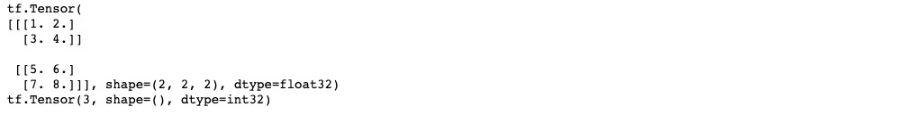
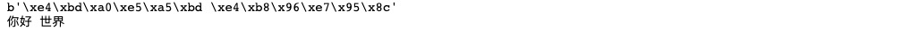
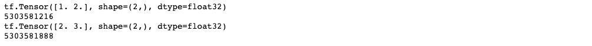
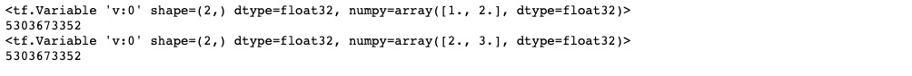

# 2-1,张量数据结构

程序 = 数据结构+算法。

TensorFlow程序 = 张量数据结构 + 计算图算法语言

张量和计算图是 TensorFlow的核心概念。

Tensorflow的基本数据结构是张量Tensor。张量即多维数组。Tensorflow的张量和numpy中的array很类似。

从行为特性来看，有两种类型的张量，常量constant和变量Variable.

常量的值在计算图中不可以被重新赋值，变量可以在计算图中用assign等算子重新赋值。


### 一，常量张量


张量的数据类型和numpy.array基本一一对应。

```python
import numpy as np
import tensorflow as tf

i = tf.constant(1) # tf.int32 类型常量
l = tf.constant(1,dtype = tf.int64) # tf.int64 类型常量
f = tf.constant(1.23) #tf.float32 类型常量
d = tf.constant(3.14,dtype = tf.double) # tf.double 类型常量
s = tf.constant("hello world") # tf.string类型常量
b = tf.constant(True) #tf.bool类型常量


print(tf.int64 == np.int64) 
print(tf.bool == np.bool)
print(tf.double == np.float64)
print(tf.string == np.unicode) # tf.string类型和np.unicode类型不等价

```


不同类型的数据可以用不同维度(rank)的张量来表示。

标量为0维张量，向量为1维张量，矩阵为2维张量。

彩色图像有rgb三个通道，可以表示为3维张量。

视频还有时间维，可以表示为4维张量。

可以简单地总结为：有几层中括号，就是多少维的张量。

```python
scalar = tf.constant(True)  #标量，0维张量

print(tf.rank(scalar))
print(scalar.numpy().ndim)  # tf.rank的作用和numpy的ndim方法相同
```

```python
vector = tf.constant([1.0,2.0,3.0,4.0]) #向量，1维张量

print(tf.rank(vector))
print(np.ndim(vector.numpy()))
```

```python
matrix = tf.constant([[1.0,2.0],[3.0,4.0]]) #矩阵, 2维张量

print(tf.rank(matrix).numpy())
print(np.ndim(matrix))
```

```python
tensor3 = tf.constant([[[1.0,2.0],[3.0,4.0]],[[5.0,6.0],[7.0,8.0]]])  # 3维张量
print(tensor3)
print(tf.rank(tensor3))
```



```python
tensor4 = tf.constant([[[[1.0,1.0],[2.0,2.0]],[[3.0,3.0],[4.0,4.0]]],
                        [[[5.0,5.0],[6.0,6.0]],[[7.0,7.0],[8.0,8.0]]]])  # 4维张量
print(tensor4)
print(tf.rank(tensor4))
```


可以用tf.cast改变张量的数据类型。

可以用numpy方法将tensorflow中的张量转化成numpy中的张量。

可以用shape方法查看张量的尺寸。

```python
h = tf.constant([123,456],dtype = tf.int32)
f = tf.cast(h,tf.float32)
print(h.dtype, f.dtype)
```

```python
y = tf.constant([[1.0,2.0],[3.0,4.0]])
print(y.numpy()) #转换成np.array
print(y.shape)
```

```python
u = tf.constant(u"你好 世界")
print(u.numpy())  
print(u.numpy().decode("utf-8"))
```



```python

```
### 二，变量张量


模型中需要被训练的参数一般被设置成变量。

```python
# 常量值不可以改变，常量的重新赋值相当于创造新的内存空间
c = tf.constant([1.0,2.0])
print(c)
print(id(c))
c = c + tf.constant([1.0,1.0])
print(c)
print(id(c))
```



```python
# 变量的值可以改变，可以通过assign, assign_add等方法给变量重新赋值
v = tf.Variable([1.0,2.0],name = "v")
print(v)
print(id(v))
v.assign_add([1.0,1.0])
print(v)
print(id(v))
```


```python

```

如果对本书内容理解上有需要进一步和作者交流的地方，欢迎在公众号"Python与算法之美"下留言。作者时间和精力有限，会酌情予以回复。


