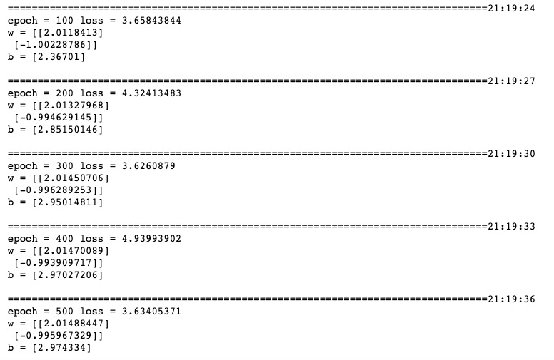

# 3-2,中阶API示范

下面的范例使用TensorFlow的中阶API实现线性回归模型。

TensorFlow的中阶API主要包括各种模型层，损失函数，优化器，数据管道，特征列等等。

```python
import tensorflow as tf
from tensorflow.keras import layers,losses,metrics,optimizers


#打印时间分割线
@tf.function
def printbar():
    ts = tf.timestamp()
    today_ts = ts%(24*60*60)

    hour = tf.cast(today_ts//3600+8,tf.int32)%tf.constant(24)
    minite = tf.cast((today_ts%3600)//60,tf.int32)
    second = tf.cast(tf.floor(today_ts%60),tf.int32)
    
    def timeformat(m):
        if tf.strings.length(tf.strings.format("{}",m))==1:
            return(tf.strings.format("0{}",m))
        else:
            return(tf.strings.format("{}",m))
    
    timestring = tf.strings.join([timeformat(hour),timeformat(minite),
                timeformat(second)],separator = ":")
    tf.print("=========="*8,end = "")
    tf.print(timestring)
    
```

```python
#样本数量
n = 800

# 生成测试用数据集
X = tf.random.uniform([n,2],minval=-10,maxval=10) 
w0 = tf.constant([[2.0],[-1.0]])
b0 = tf.constant(3.0)
Y = X@w0 + b0 + tf.random.normal([n,1],mean = 0.0,stddev= 2.0)  # @表示矩阵乘法,增加正态扰动

#构建输入数据管道
ds = tf.data.Dataset.from_tensor_slices((X,Y)) \
     .shuffle(buffer_size = 1000).batch(100) \
     .prefetch(tf.data.experimental.AUTOTUNE)  

#定义优化器
optimizer = optimizers.SGD(learning_rate=0.001)

```

```python
linear = layers.Dense(units = 1)
linear.build(input_shape = (2,)) 

@tf.function
def train(epoches):
    for epoch in tf.range(1,epoches+1):
        L = tf.constant(0.0) #使用L记录loss值
        for X_batch,Y_batch in ds:
            with tf.GradientTape() as tape:
                Y_hat = linear(X_batch)
                loss = losses.mean_squared_error(tf.reshape(Y_hat,[-1]),tf.reshape(Y_batch,[-1]))
            grads = tape.gradient(loss,linear.variables)
            optimizer.apply_gradients(zip(grads,linear.variables))
            L = loss
        
        if(epoch%100==0):
            printbar()
            tf.print("epoch =",epoch,"loss =",L)
            tf.print("w =",linear.kernel)
            tf.print("b =",linear.bias)
            tf.print("")

train(500)
```




如果对本书内容理解上有需要进一步和作者交流的地方，欢迎在公众号"Python与算法之美"下留言。作者时间和精力有限，会酌情予以回复。

也可以在公众号后台回复关键字：**加群**，加入读者交流群和大家讨论。


