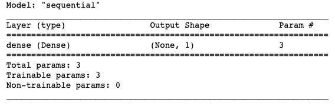
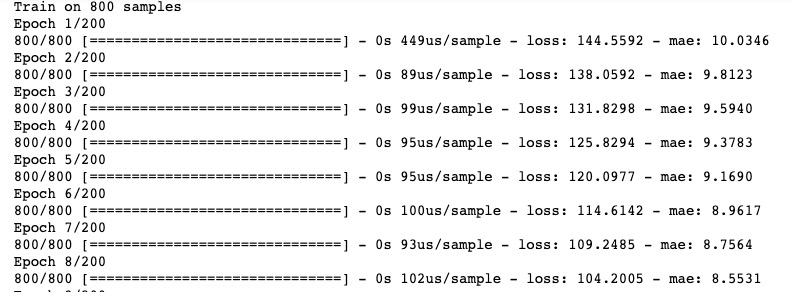
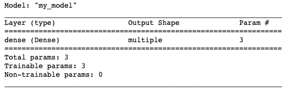
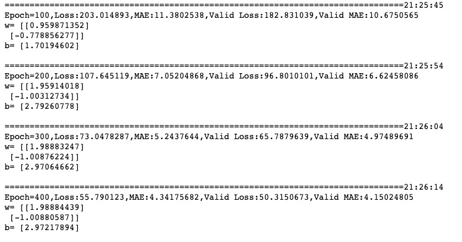

# 3-3,高阶API示范

下面的范例使用TensorFlow的高阶API实现线性回归模型。

TensorFlow的高阶API主要为tf.keras.models提供的模型的类接口。


使用Keras接口有以下3种方式构建模型：使用Sequential按层顺序构建模型，使用函数式API构建任意结构模型，继承Model基类构建自定义模型。

此处分别演示使用Sequential按层顺序构建模型以及继承Model基类构建自定义模型。


### 一，使用Sequential按层顺序构建模型【面向新手】

```python
import tensorflow as tf
from tensorflow.keras import models,layers,optimizers

#样本数量
n = 800

# 生成测试用数据集
X = tf.random.uniform([n,2],minval=-10,maxval=10) 
w0 = tf.constant([[2.0],[-1.0]])
b0 = tf.constant(3.0)

Y = X@w0 + b0 + tf.random.normal([n,1],mean = 0.0,stddev= 2.0)  # @表示矩阵乘法,增加正态扰动
```

```python
tf.keras.backend.clear_session()

linear = models.Sequential()
linear.add(layers.Dense(1,input_shape =(2,)))
linear.summary()
```



```python
### 使用fit方法进行训练

linear.compile(optimizer="adam",loss="mse",metrics=["mae"])
linear.fit(X,Y,batch_size = 20,epochs = 200)  

tf.print("w = ",linear.layers[0].kernel)
tf.print("b = ",linear.layers[0].bias)

```



```python

```

### 二，继承Model基类构建自定义模型【面向专家】

```python
import tensorflow as tf
from tensorflow.keras import models,layers,optimizers,losses,metrics


#打印时间分割线
@tf.function
def printbar():
    ts = tf.timestamp()
    today_ts = ts%(24*60*60)

    hour = tf.cast(today_ts//3600+8,tf.int32)%tf.constant(24)
    minite = tf.cast((today_ts%3600)//60,tf.int32)
    second = tf.cast(tf.floor(today_ts%60),tf.int32)
    
    def timeformat(m):
        if tf.strings.length(tf.strings.format("{}",m))==1:
            return(tf.strings.format("0{}",m))
        else:
            return(tf.strings.format("{}",m))
    
    timestring = tf.strings.join([timeformat(hour),timeformat(minite),
                timeformat(second)],separator = ":")
    tf.print("=========="*8,end = "")
    tf.print(timestring)
    
```

```python
#样本数量
n = 800

# 生成测试用数据集
X = tf.random.uniform([n,2],minval=-10,maxval=10) 
w0 = tf.constant([[2.0],[-1.0]])
b0 = tf.constant(3.0)

Y = X@w0 + b0 + tf.random.normal([n,1],mean = 0.0,stddev= 2.0)  # @表示矩阵乘法,增加正态扰动

ds_train = tf.data.Dataset.from_tensor_slices((X[0:n*3//4,:],Y[0:n*3//4,:])) \
     .shuffle(buffer_size = 1000).batch(20) \
     .prefetch(tf.data.experimental.AUTOTUNE) \
     .cache()

ds_valid = tf.data.Dataset.from_tensor_slices((X[n*3//4:,:],Y[n*3//4:,:])) \
     .shuffle(buffer_size = 1000).batch(20) \
     .prefetch(tf.data.experimental.AUTOTUNE) \
     .cache()

```

```python
tf.keras.backend.clear_session()

class MyModel(models.Model):
    def __init__(self):
        super(MyModel, self).__init__()
        
    def build(self,input_shape):
        self.dense1 = layers.Dense(1)   
        super(MyModel,self).build(input_shape)
    
    def call(self, x):
        y = self.dense1(x)
        return(y)

model = MyModel()
model.build(input_shape =(None,2))
model.summary()

```



```python
### 自定义训练循环(专家教程)


optimizer = optimizers.Adam()
loss_func = losses.MeanSquaredError()

train_loss = tf.keras.metrics.Mean(name='train_loss')
train_metric = tf.keras.metrics.MeanAbsoluteError(name='train_mae')

valid_loss = tf.keras.metrics.Mean(name='valid_loss')
valid_metric = tf.keras.metrics.MeanAbsoluteError(name='valid_mae')


@tf.function
def train_step(model, features, labels):
    with tf.GradientTape() as tape:
        predictions = model(features)
        loss = loss_func(labels, predictions)
    gradients = tape.gradient(loss, model.trainable_variables)
    optimizer.apply_gradients(zip(gradients, model.trainable_variables))

    train_loss.update_state(loss)
    train_metric.update_state(labels, predictions)

@tf.function
def valid_step(model, features, labels):
    predictions = model(features)
    batch_loss = loss_func(labels, predictions)
    valid_loss.update_state(batch_loss)
    valid_metric.update_state(labels, predictions)
    

@tf.function
def train_model(model,ds_train,ds_valid,epochs):
    for epoch in tf.range(1,epochs+1):
        for features, labels in ds_train:
            train_step(model,features,labels)

        for features, labels in ds_valid:
            valid_step(model,features,labels)

        logs = 'Epoch={},Loss:{},MAE:{},Valid Loss:{},Valid MAE:{}'
        
        if  epoch%100 ==0:
            printbar()
            tf.print(tf.strings.format(logs,
            (epoch,train_loss.result(),train_metric.result(),valid_loss.result(),valid_metric.result())))
            tf.print("w=",model.layers[0].kernel)
            tf.print("b=",model.layers[0].bias)
            tf.print("")
        
        train_loss.reset_states()
        valid_loss.reset_states()
        train_metric.reset_states()
        valid_metric.reset_states()

train_model(model,ds_train,ds_valid,400)

```




如果对本书内容理解上有需要进一步和作者交流的地方，欢迎在公众号"Python与算法之美"下留言。作者时间和精力有限，会酌情予以回复。

也可以在公众号后台回复关键字：**加群**，加入读者交流群和大家讨论。


