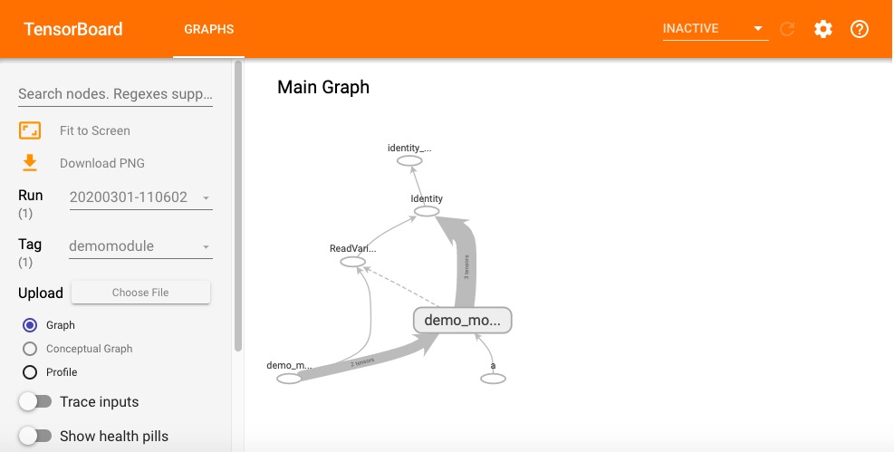

# 4-5,AutoGraph和tf.Module


有三种计算图的构建方式：静态计算图，动态计算图，以及Autograph。

TensorFlow 2.0主要使用的是动态计算图和Autograph。

动态计算图易于调试，编码效率较高，但执行效率偏低。

静态计算图执行效率很高，但较难调试。

而Autograph机制可以将动态图转换成静态计算图，兼收执行效率和编码效率之利。

当然Autograph机制能够转换的代码并不是没有任何约束的，有一些编码规范需要遵循，否则可能会转换失败或者不符合预期。

前面我们介绍了Autograph的编码规范和Autograph转换成静态图的原理。

本篇我们介绍使用tf.Module来更好地构建Autograph。


### 一，Autograph和tf.Module概述


前面在介绍Autograph的编码规范时提到构建Autograph时应该避免在@tf.function修饰的函数内部定义tf.Variable. 

但是如果在函数外部定义tf.Variable的话，又会显得这个函数有外部变量依赖，封装不够完美。

一种简单的思路是定义一个类，并将相关的tf.Variable创建放在类的初始化方法中。而将函数的逻辑放在其他方法中。

这样一顿猛如虎的操作之后，我们会觉得一切都如同人法地地法天天法道道法自然般的自然。

惊喜的是，TensorFlow提供了一个基类tf.Module，通过继承它构建子类，我们不仅可以获得以上的自然而然，而且可以非常方便地管理变量，还可以非常方便地管理它引用的其它Module，最重要的是，我们能够利用tf.saved_model保存模型并实现跨平台部署使用。

实际上，tf.keras.models.Model,tf.keras.layers.Layer 都是继承自tf.Module的，提供了方便的变量管理和所引用的子模块管理的功能。

**因此，利用tf.Module提供的封装，再结合TensoFlow丰富的低阶API，实际上我们能够基于TensorFlow开发任意机器学习模型(而非仅仅是神经网络模型)，并实现跨平台部署使用。**


### 二，应用tf.Module封装Autograph


定义一个简单的function。

```python
import tensorflow as tf 
x = tf.Variable(1.0,dtype=tf.float32)

#在tf.function中用input_signature限定输入张量的签名类型：shape和dtype
@tf.function(input_signature=[tf.TensorSpec(shape = [], dtype = tf.float32)])    
def add_print(a):
    x.assign_add(a)
    tf.print(x)
    return(x)
```

```python
add_print(tf.constant(3.0))
#add_print(tf.constant(3)) #输入不符合张量签名的参数将报错
```

```
4
```


下面利用tf.Module的子类化将其封装一下。

```python
class DemoModule(tf.Module):
    def __init__(self,init_value = tf.constant(0.0),name=None):
        super(DemoModule, self).__init__(name=name)
        with self.name_scope:  #相当于with tf.name_scope("demo_module")
            self.x = tf.Variable(init_value,dtype = tf.float32,trainable=True)

     
    @tf.function(input_signature=[tf.TensorSpec(shape = [], dtype = tf.float32)])  
    def addprint(self,a):
        with self.name_scope:
            self.x.assign_add(a)
            tf.print(self.x)
            return(self.x)

```

```python
#执行
demo = DemoModule(init_value = tf.constant(1.0))
result = demo.addprint(tf.constant(5.0))
```

```
6
```

```python
#查看模块中的全部变量和全部可训练变量
print(demo.variables)
print(demo.trainable_variables)
```

```
(<tf.Variable 'demo_module/Variable:0' shape=() dtype=float32, numpy=6.0>,)
(<tf.Variable 'demo_module/Variable:0' shape=() dtype=float32, numpy=6.0>,)
```

```python
#查看模块中的全部子模块
demo.submodules
```

```python
#使用tf.saved_model 保存模型，并指定需要跨平台部署的方法
tf.saved_model.save(demo,"./data/demo/1",signatures = {"serving_default":demo.addprint})
```

```python
#加载模型
demo2 = tf.saved_model.load("./data/demo/1")
demo2.addprint(tf.constant(5.0))
```

```
11
```

```python
# 查看模型文件相关信息，红框标出来的输出信息在模型部署和跨平台使用时有可能会用到
!saved_model_cli show --dir ./data/demo/1 --all
```


```python

```

在tensorboard中查看计算图，模块会被添加模块名demo_module,方便层次化呈现计算图结构。

```python
import datetime

# 创建日志
stamp = datetime.datetime.now().strftime("%Y%m%d-%H%M%S")
logdir = './data/demomodule/%s' % stamp
writer = tf.summary.create_file_writer(logdir)

#开启autograph跟踪
tf.summary.trace_on(graph=True, profiler=True) 

#执行autograph
demo = DemoModule(init_value = tf.constant(0.0))
result = demo.addprint(tf.constant(5.0))

#将计算图信息写入日志
with writer.as_default():
    tf.summary.trace_export(
        name="demomodule",
        step=0,
        profiler_outdir=logdir)
    
```

```python

```

```python
#启动 tensorboard在jupyter中的魔法命令
%reload_ext tensorboard
```

```python
from tensorboard import notebook
notebook.list() 
```

```python
notebook.start("--logdir ./data/demomodule/")
```



```python

```

除了利用tf.Module的子类化实现封装，我们也可以通过给tf.Module添加属性的方法进行封装。

```python
mymodule = tf.Module()
mymodule.x = tf.Variable(0.0)

@tf.function(input_signature=[tf.TensorSpec(shape = [], dtype = tf.float32)])  
def addprint(a):
    mymodule.x.assign_add(a)
    tf.print(mymodule.x)
    return (mymodule.x)

mymodule.addprint = addprint
```

```python
mymodule.addprint(tf.constant(1.0)).numpy()
```

```
1.0
```

```python
print(mymodule.variables)
```

```
(<tf.Variable 'Variable:0' shape=() dtype=float32, numpy=0.0>,)
```

```python
#使用tf.saved_model 保存模型
tf.saved_model.save(mymodule,"./data/mymodule",
    signatures = {"serving_default":mymodule.addprint})

#加载模型
mymodule2 = tf.saved_model.load("./data/mymodule")
mymodule2.addprint(tf.constant(5.0))
```

```
INFO:tensorflow:Assets written to: ./data/mymodule/assets
5
```

```python

```

### 三，tf.Module和tf.keras.Model，tf.keras.layers.Layer


tf.keras中的模型和层都是继承tf.Module实现的，也具有变量管理和子模块管理功能。

```python
import tensorflow as tf
from tensorflow.keras import models,layers,losses,metrics
```

```python
print(issubclass(tf.keras.Model,tf.Module))
print(issubclass(tf.keras.layers.Layer,tf.Module))
print(issubclass(tf.keras.Model,tf.keras.layers.Layer))
```

```
True
True
True
```

```python
tf.keras.backend.clear_session() 

model = models.Sequential()

model.add(layers.Dense(4,input_shape = (10,)))
model.add(layers.Dense(2))
model.add(layers.Dense(1))
model.summary()
```

```
Model: "sequential"
_________________________________________________________________
Layer (type)                 Output Shape              Param #   
=================================================================
dense (Dense)                (None, 4)                 44        
_________________________________________________________________
dense_1 (Dense)              (None, 2)                 10        
_________________________________________________________________
dense_2 (Dense)              (None, 1)                 3         
=================================================================
Total params: 57
Trainable params: 57
Non-trainable params: 0
_________________________________________________________________
```

```python
model.variables
```

```
[<tf.Variable 'dense/kernel:0' shape=(10, 4) dtype=float32, numpy=
 array([[-0.06741005,  0.45534766,  0.5190817 , -0.01806331],
        [-0.14258742, -0.49711505,  0.26030976,  0.18607801],
        [-0.62806034,  0.5327399 ,  0.42206633,  0.29201728],
        [-0.16602087, -0.18901917,  0.55159235, -0.01091868],
        [ 0.04533798,  0.326845  , -0.582667  ,  0.19431782],
        [ 0.6494713 , -0.16174704,  0.4062966 ,  0.48760796],
        [ 0.58400524, -0.6280886 , -0.11265379, -0.6438277 ],
        [ 0.26642334,  0.49275804,  0.20793378, -0.43889117],
        [ 0.4092741 ,  0.09871006, -0.2073121 ,  0.26047975],
        [ 0.43910992,  0.00199282, -0.07711256, -0.27966842]],
       dtype=float32)>,
 <tf.Variable 'dense/bias:0' shape=(4,) dtype=float32, numpy=array([0., 0., 0., 0.], dtype=float32)>,
 <tf.Variable 'dense_1/kernel:0' shape=(4, 2) dtype=float32, numpy=
 array([[ 0.5022683 , -0.0507431 ],
        [-0.61540484,  0.9369011 ],
        [-0.14412141, -0.54607415],
        [ 0.2027781 , -0.4651153 ]], dtype=float32)>,
 <tf.Variable 'dense_1/bias:0' shape=(2,) dtype=float32, numpy=array([0., 0.], dtype=float32)>,
 <tf.Variable 'dense_2/kernel:0' shape=(2, 1) dtype=float32, numpy=
 array([[-0.244825 ],
        [-1.2101456]], dtype=float32)>,
 <tf.Variable 'dense_2/bias:0' shape=(1,) dtype=float32, numpy=array([0.], dtype=float32)>]
```

```python
model.layers[0].trainable = False #冻结第0层的变量,使其不可训练
model.trainable_variables
```

```
[<tf.Variable 'dense_1/kernel:0' shape=(4, 2) dtype=float32, numpy=
 array([[ 0.5022683 , -0.0507431 ],
        [-0.61540484,  0.9369011 ],
        [-0.14412141, -0.54607415],
        [ 0.2027781 , -0.4651153 ]], dtype=float32)>,
 <tf.Variable 'dense_1/bias:0' shape=(2,) dtype=float32, numpy=array([0., 0.], dtype=float32)>,
 <tf.Variable 'dense_2/kernel:0' shape=(2, 1) dtype=float32, numpy=
 array([[-0.244825 ],
        [-1.2101456]], dtype=float32)>,
 <tf.Variable 'dense_2/bias:0' shape=(1,) dtype=float32, numpy=array([0.], dtype=float32)>]
```

```python
model.submodules
```

```
(<tensorflow.python.keras.engine.input_layer.InputLayer at 0x144d8c080>,
 <tensorflow.python.keras.layers.core.Dense at 0x144daada0>,
 <tensorflow.python.keras.layers.core.Dense at 0x144d8c5c0>,
 <tensorflow.python.keras.layers.core.Dense at 0x144d7aa20>)
```

```python
model.layers
```

```
[<tensorflow.python.keras.layers.core.Dense at 0x144daada0>,
 <tensorflow.python.keras.layers.core.Dense at 0x144d8c5c0>,
 <tensorflow.python.keras.layers.core.Dense at 0x144d7aa20>]
```

```python
print(model.name)
print(model.name_scope())
```

```
sequential
sequential
```

```python

```

如果对本书内容理解上有需要进一步和作者交流的地方，欢迎在公众号"算法美食屋"下留言。作者时间和精力有限，会酌情予以回复。

也可以在公众号后台回复关键字：**加群**，加入读者交流群和大家讨论。


