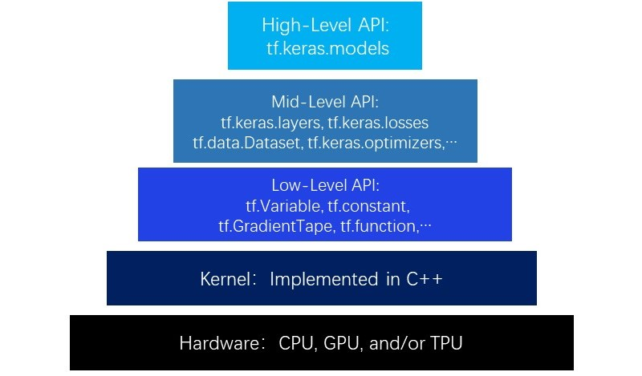

# Chapter 3: Hierarchy of TensorFlow

We are going to introduce five levels of TensorFlow in this chapter: Hardware Level, Kernel Level, Low-level API, Mid-level API, High-level API. We are also showing the differences when implementing the same model for linear regression at different API levels.

From lower to higher, there are five levels in TensorFlow hierarchy.

The bottom one is hardware level. TensorFlow supports adding CPU, GPU or TPU to the resource pool of computing.

The second level is the kernel implementing C++. These kernels are able to run on distributed cross platforms.

The third level contains operators in written in Python, which provides low-level API instructions that packaging C++ kernels, including operators, graphs, automatic differentiate, etc.
For example: `tf.Variable`, `tf.constant`, `tf.function`, `tf.GradientTape`, `tf.nn.softmax`...
If we compare a model to a house, then these third level APIs are the bricks.

The fourth level contains model components implemented in Python. They provide packaging to the low-level API functions, including model layers, loss functions, optimizers, data pipelines, and feature columns, etc. 
For example: `tf.keras.layers`, `tf.keras.losses`, `tf.keras.metrics`, `tf.keras.optimizers`, `tf.data.DataSet`, `tf.feature_column`...
If we compare a model to a house, then these fourth level APIs are the walls.

The fifth level contains well-designed models implemented in Python. Most of them are high-level APIs packaged by OOP, typically are the class interfaces for `tf.keras.models`.
If we compare a model to a house, then these fourth level APIs are the houses themselves.

Please leave comments in the WeChat official account "Python与算法之美" (Beauty of Python and Algorithms) if you want to communicate with the author about the content. The author will try best to reply given the limited time available.

You are also welcomed to reply **加群(join group)** in the WeChat official account to join the group chat with the other readers.

