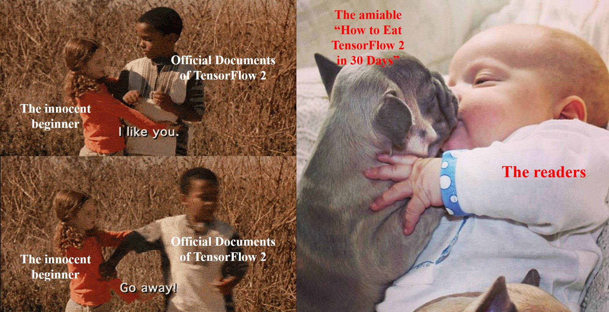

<!-- #region -->
# How to eat TensorFlow2 in 30 days ?🔥🔥

Click here for [Chinese Version（中文版）](#30天吃掉那只-tensorflow2)

**《10天吃掉那只pyspark》**
* 🚀 github项目地址: https://github.com/lyhue1991/eat_pyspark_in_10_days
* 🐳 和鲸专栏地址: https://www.kesci.com/home/column/5fe6aa955e24ed00302304e0 【代码可直接fork后云端运行，无需配置环境】


**《20天吃掉那只Pytorch》**
* 🚀 github项目地址: https://github.com/lyhue1991/eat_pytorch_in_20_days
* 🐳 和鲸专栏地址: https://www.kesci.com/home/column/5f2ac5d8af3980002cb1bc08 【代码可直接fork后云端运行，无需配置环境】


**《30天吃掉那只TensorFlow2》**
* 🚀 github项目地址: https://github.com/lyhue1991/eat_tensorflow2_in_30_days
* 🐳 和鲸专栏地址: https://www.kesci.com/home/column/5d8ef3c3037db3002d3aa3a0 【代码可直接fork后云端运行，无需配置环境】

**极速通道** 
*  🚀 公众号 “**算法美食屋**” 后台回复暗号："**吃货来了**"
*  😋 获取以上3套教程的jupyter notebook 源码文件以及全部数据集的百度云盘下载链接。
*   https://mp.weixin.qq.com/s/ymLtH5BqlWAkpOmCLQOYxw 


<!-- #endregion -->

### 1. TensorFlow2 🍎 or Pytorch🔥

Conclusion first: 

**For the engineers, priority goes to TensorFlow2.**

**For the students and researchers，first choice should be Pytorch.**

**The best way is to master both of them if having sufficient time.**


Reasons:

* 1. **Model implementation is the most important in the industry. Deployment supporting tensorflow models (not Pytorch) exclusively is the present situation in the majority of the Internet enterprises in China.** What's more, the industry prefers the models with higher availability; in most cases, they use well-validated modeling architectures with the minimized requirements of adjustment.


* 2. **Fast iterative development and publication is the most important for the researchers since they need to test a lot of new models. Pytorch has advantages in accessing and debugging comparing with TensorFlow2.** Pytorch is most frequently used in academy since 2019 with a large amount of the cutting-edge results.


* 3. Overall, TensorFlow2 and Pytorch are quite similar in programming nowadays, so mastering one helps learning the other. Mastering both framework provides you a lot more open-sourced models and helps you switching between them.

```python

```

### 2. Keras🍏 and tf.keras 🍎

Conclusion first: 

**Keras will be discontinued in development after version 2.3.0, so use tf.keras.**


Keras is a high-level API for the deep learning frameworks. It help the users to define and training DL networks with a more intuitive way.

The Keras libraries installed by pip implement this high-level API for the backends in tensorflow, theano, CNTK, etc.

tf.keras is the high-level API just for Tensorflow, which is based on low-level APIs in Tensorflow.

Most but not all of the functions in tf.keras are the same for those in Keras (which is compatible to many kinds of backend). tf.keras has a tighter combination to TensorFlow comparing to Keras.

With the acquisition by Google, Keras will not update after version 2.3.0 , thus the users should use tf.keras from now on, instead of using Keras installed by pip.

```python

```

### 3. What Should You Know Before Reading This Book 📖?

**It is suggested that the readers have foundamental knowledges of machine/deep learning and experience of modeling using Keras or TensorFlow 1.0.**

**For those who have zero experience of machine/deep learning, it is strongly suggested to refer to ["Deep Learning with Python"](https://www.amazon.com/Deep-Learning-Python-Francois-Chollet/dp/1617294438/ref=sr_1_1?dchild=1&keywords=Deep+Learning+with+Python&qid=1586194568&sr=8-1) along with reading this book.**


["Deep Learning with Python"](https://www.amazon.com/Deep-Learning-Python-Francois-Chollet/dp/1617294438/ref=sr_1_1?dchild=1&keywords=Deep+Learning+with+Python&qid=1586194568&sr=8-1) is written by François Chollet, the inventor of Keras. This book is based on Keras and has no machine learning related prerequisites to the reader.

"Deep Learning with Python" is easy to understand as it uses various examples to demonstrate. **No mathematical equation is in this book since it focuses on cultivating the intuitive to the deep learning.**


```python

```

### 4. Writing Style 🍉 of This Book


**This is a introduction reference book which is extremely friendly to human being. The lowest goal of the authors is to avoid giving up due to the difficulties, while "Don't let the readers think" is the highest target.**

This book is mainly based on the official documents of TensorFlow together with its functions.

However, the authors made a thorough restructuring and a lot optimizations on the demonstrations.

It is different from the official documents, which is disordered and contains both tutorial and guidance with lack of systematic logic, that our book redesigns the content according to the difficulties, readers' searching habits, and the architecture of TensorFlow. We now make it progressive for TensorFlow studying with a clear path, and an easy access to the corresponding examples.

In contrast to the verbose demonstrating code, the authors of this book try to minimize the length of the examples to make it easy for reading and implementation. What's more, most of the code cells can be used in your project instantaneously.

**Given the level of difficulty as 9 for learning Tensorflow through official documents, it would be reduced to 3 if learning through this book.**

This difference in difficulties could be demonstrated as the following figure:




```python

```

### 5. How to Learn With This Book ⏰

**(1) Study Plan**

The authors wrote this book using the spare time, especially the two-month unexpected "holiday" of COVID-19. Most readers should be able to completely master all the content within 30 days.

Time required everyday would be between 30 minutes to 2 hours.

This book could also be used as library examples to consult when implementing machine learning projects with TensorFlow2.

**Click the blue captions to enter the corresponding chapter.**


|Date |Contents                                                       | Difficulties   | Est. Time | Update Status|
|----:|:--------------------------------------------------------------|-----------:|----------:|-----:|
|&nbsp;|[**Chapter 1: Modeling Procedure of TensorFlow**](./english/Chapter1.md)    |⭐️   |   0hour   |✅    |
|Day 1 |  [1-1 Example: Modeling Procedure for Structured Data](./english/Chapter1-1.md)    | ⭐️⭐️⭐️ |   1hour    |✅    |
|Day 2 |[1-2 Example: Modeling Procedure for Images](./english/Chapter1-2.md)    | ⭐️⭐️⭐️⭐️  |   2hours    |✅    |
|Day 3 |  [1-3 Example: Modeling Procedure for Texts](./english/Chapter1-3.md)   | ⭐️⭐️⭐️⭐️⭐️  |   2hours    |✅    |
|Day 4 |  [1-4 Example: Modeling Procedure for Temporal Sequences](./english/Chapter1-4.md)   | ⭐️⭐️⭐️⭐️⭐️  |   2hours    |✅    |
|&nbsp;    |[**Chapter 2: Key Concepts of TensorFlow**](./english/Chapter2.md)  | ⭐️  |  0hour |✅  |
|Day 5 |  [2-1 Data Structure of Tensor](./english/Chapter2-1.md)  | ⭐️⭐️⭐️⭐️   |   1hour    |✅    |
|Day 6 |  [2-2 Three Types of Graph](./english/Chapter2-2.md)  | ⭐️⭐️⭐️⭐️⭐️   |   2hours    |✅    |
|Day 7 |  [2-3 Automatic Differentiate](./english/Chapter2-3.md)  | ⭐️⭐️⭐️   |   1hour    |✅    |
|&nbsp; |[**Chapter 3: Hierarchy of TensorFlow**](./english/Chapter3.md) |   ⭐️  |  0hour   |✅  |
|Day 8 |  [3-1 Low-level API: Demonstration](./english/Chapter3-1.md)   | ⭐️⭐️⭐️⭐️ |   1hour    |✅   |
|Day 9 |  [3-2 Mid-level API: Demonstration](./english/Chapter3-2.md)   | ⭐️⭐️⭐️   |   1hour    |✅  |
|Day 10 |  [3-3 High-level API: Demonstration](./english/Chapter3-3.md)  | ⭐️⭐️⭐️   |   1hour    |✅  |
|&nbsp; |[**Chapter 4: Low-level API in TensorFlow**](./english/Chapter4.md) |⭐️    | 0hour|✅  |
|Day 11|  [4-1 Structural Operations of the Tensor](./english/Chapter4-1.md)  | ⭐️⭐️⭐️⭐️⭐️   |   2hours    |✅   |
|Day 12|  [4-2 Mathematical Operations of the Tensor](./english/Chapter4-2.md)   | ⭐️⭐️⭐️⭐️   |   1hour    |✅  |
|Day 13|  [4-3 Rules of Using the AutoGraph](./english/Chapter4-3.md)| ⭐️⭐️⭐️   |   0.5hour    | ✅  |
|Day 14|  [4-4 Mechanisms of the AutoGraph](./english/Chapter4-4.md)    | ⭐️⭐️⭐️⭐️⭐️   |   2hours    |✅  |
|Day 15|  [4-5 AutoGraph and tf.Module](./english/Chapter4-5.md)  | ⭐️⭐️⭐️⭐️   |   1hour    |✅  |
|&nbsp; |[**Chapter 5: Mid-level API in TensorFlow**](./english/Chapter5.md) |  ⭐️  | 0hour|✅ |
|Day 16|  [5-1 Dataset](./english/Chapter5-1.md)   | ⭐️⭐️⭐️⭐️⭐️   |   2hours    |✅  |
|Day 17|  [5-2 feature_column](./english/Chapter5-2.md)   | ⭐️⭐️⭐️⭐️   |   1hour    |✅  |
|Day 18|  [5-3 activation](./english/Chapter5-3.md)    | ⭐️⭐️⭐️   |   0.5hour    |✅   |
|Day 19|  [5-4 layers](./english/Chapter5-4.md)  | ⭐️⭐️⭐️   |   1hour    |✅  |
|Day 20|  [5-5 losses](./english/Chapter5-5.md)    | ⭐️⭐️⭐️   |   1hour    |✅  |
|Day 21|  [5-6 metrics](./english/Chapter5-6.md)    | ⭐️⭐️⭐️   |   1hour    |✅   |
|Day 22|  [5-7 optimizers](./english/Chapter5-7.md)    | ⭐️⭐️⭐️   |   0.5hour    |✅   |
|Day 23|  [5-8 callbacks](./english/Chapter5-8.md)   | ⭐️⭐️⭐️⭐️   |   1hour    |✅   |
|&nbsp; |[**Chapter 6: High-level API in TensorFlow**](./english/Chapter6.md)|    ⭐️ | 0hour|✅  |
|Day 24|  [6-1 Three Ways of Modeling](./english/Chapter6-1.md)   | ⭐️⭐️⭐️   |   1hour    |✅ |
|Day 25|  [6-2 Three Ways of Training](./english/Chapter6-2.md)  | ⭐️⭐️⭐️⭐️   |   1hour    |✅   |
|Day 26|  [6-3 Model Training Using Single GPU](./english/Chapter6-3.md)    | ⭐️⭐️   |   0.5hour    |✅   |
|Day 27|  [6-4 Model Training Using Multiple GPUs](./english/Chapter6-4.md)    | ⭐️⭐️   |   0.5hour    |✅  |
|Day 28|  [6-5 Model Training Using TPU](./english/Chapter6-5.md)   | ⭐️⭐️   |   0.5hour    |✅  |
|Day 29| [6-6 Model Deploying Using tensorflow-serving](./english/Chapter6-6.md) | ⭐️⭐️⭐️⭐️| 1hour |✅   |
|Day 30| [6-7 Call Tensorflow Model Using spark-scala](./english/Chapter6-7.md) | ⭐️⭐️⭐️⭐️⭐️|2hours|✅  |
|&nbsp;| [Epilogue: A Story Between a Foodie and Cuisine](./english/Epilogue.md) | ⭐️|0hour|✅  |

```python

```

**(2) Software environment for studying**


All the source codes are tested in jupyter. It is suggested to clone the repository to local machine and run them in jupyter for an interactive learning experience.

The authors would suggest to install jupytext that converts markdown files into ipynb, so the readers would be able to open markdown files in jupyter directly.

```python
#For the readers in mainland China, using gitee will allow cloning with a faster speed
#!git clone https://gitee.com/Python_Ai_Road/eat_tensorflow2_in_30_days

#It is suggested to install jupytext that converts and run markdown files as ipynb.
#!pip install -i https://pypi.tuna.tsinghua.edu.cn/simple -U jupytext
    
#It is also suggested to install the latest version of TensorFlow to test the demonstrating code in this book
#!pip install -i https://pypi.tuna.tsinghua.edu.cn/simple  -U tensorflow
```

```python
import tensorflow as tf

#Note: all the codes are tested under TensorFlow 2.1
tf.print("tensorflow version:",tf.__version__)

a = tf.constant("hello")
b = tf.constant("tensorflow2")
c = tf.strings.join([a,b]," ")
tf.print(c)
```

```
tensorflow version: 2.1.0
hello tensorflow2
```

```python

```

### 6. Contact and support the author 🎈🎈


**If you find this book helpful and want to support the author, please give a star ⭐️ to this repository and don't forget to share it to your friends 😊** 

Please leave comments in the WeChat official account "算法美食屋" (Machine Learning  cook house) if you want to communicate with the author about the content. The author will try best to reply given the limited time available.


```python

```
# 30天吃掉那只 TensorFlow2

📚 gitbook电子书地址： https://lyhue1991.github.io/eat_tensorflow2_in_30_days

🚀 github项目地址：https://github.com/lyhue1991/eat_tensorflow2_in_30_days

🐳 kesci专栏地址：https://www.kesci.com/home/column/5d8ef3c3037db3002d3aa3a0

**极速通道** 
*  🚀 公众号 “**算法美食屋**” 后台回复暗号："**吃货来了**"
*  😋 获取教程的jupyter notebook 源码文件以及全部数据集的百度云盘下载链接。
*  https://mp.weixin.qq.com/s/ymLtH5BqlWAkpOmCLQOYxw


### 一，TensorFlow2 🍎 or Pytorch🔥

先说结论:

**如果是工程师，应该优先选TensorFlow2.**

**如果是学生或者研究人员，应该优先选择Pytorch.**

**如果时间足够，最好TensorFlow2和Pytorch都要学习掌握。**


理由如下：

* 1，**在工业界最重要的是模型落地，目前国内的大部分互联网企业只支持TensorFlow模型的在线部署，不支持Pytorch。** 并且工业界更加注重的是模型的高可用性，许多时候使用的都是成熟的模型架构，调试需求并不大。


* 2，**研究人员最重要的是快速迭代发表文章，需要尝试一些较新的模型架构。而Pytorch在易用性上相比TensorFlow2有一些优势，更加方便调试。** 并且在2019年以来在学术界占领了大半壁江山，能够找到的相应最新研究成果更多。


* 3，TensorFlow2和Pytorch实际上整体风格已经非常相似了，学会了其中一个，学习另外一个将比较容易。两种框架都掌握的话，能够参考的开源模型案例更多，并且可以方便地在两种框架之间切换。

```python

```

### 二，Keras🍏 and  tf.keras 🍎

先说结论：

**Keras库在2.3.0版本后将不再更新，用户应该使用tf.keras。**


Keras可以看成是一种深度学习框架的高阶接口规范，它帮助用户以更简洁的形式定义和训练深度学习网络。

使用pip安装的Keras库同时在tensorflow,theano,CNTK等后端基础上进行了这种高阶接口规范的实现。

而tf.keras是在TensorFlow中以TensorFlow低阶API为基础实现的这种高阶接口，它是Tensorflow的一个子模块。

tf.keras绝大部分功能和兼容多种后端的Keras库用法完全一样，但并非全部，它和TensorFlow之间的结合更为紧密。

随着谷歌对Keras的收购，Keras库2.3.0版本后也将不再进行更新，用户应当使用tf.keras而不是使用pip安装的Keras.

```python

```

### 三，本书📖面向读者 👼


**本书假定读者有一定的机器学习和深度学习基础，使用过Keras或者Tensorflow1.0或者Pytorch搭建训练过模型。**

**对于没有任何机器学习和深度学习基础的同学，建议在学习本书时同步参考学习《Python深度学习》一书。**

《Python深度学习》这本书是Keras之父Francois Chollet所著，该书假定读者无任何机器学习知识，以Keras为工具，

使用丰富的范例示范深度学习的最佳实践，该书通俗易懂，**全书没有一个数学公式，注重培养读者的深度学习直觉。**。

```python

```

### 四，本书写作风格 🍉


**本书是一本对人类用户极其友善的TensorFlow2.0入门工具书，不刻意恶心读者是本书的底限要求，Don't let me think是本书的最高追求。**

本书主要是在参考TensorFlow官方文档和函数doc文档基础上整理写成的。

但本书在篇章结构和范例选取上做了大量的优化。

不同于官方文档混乱的篇章结构，既有教程又有指南，缺少整体的编排逻辑。

本书按照内容难易程度、读者检索习惯和TensorFlow自身的层次结构设计内容，循序渐进，层次清晰，方便按照功能查找相应范例。

不同于官方文档冗长的范例代码，本书在范例设计上尽可能简约化和结构化，增强范例易读性和通用性，大部分代码片段在实践中可即取即用。

**如果说通过学习TensorFlow官方文档掌握TensorFlow2.0的难度大概是9的话，那么通过学习本书掌握TensorFlow2.0的难度应该大概是3.**

谨以下图对比一下TensorFlow官方教程与本教程的差异。


```python

```

### 五，本书学习方案 ⏰

**1，学习计划**

本书是作者利用工作之余和疫情放假期间大概2个月写成的，大部分读者应该在30天可以完全学会。

预计每天花费的学习时间在30分钟到2个小时之间。

当然，本书也非常适合作为TensorFlow的工具手册在工程落地时作为范例库参考。

**点击学习内容蓝色标题即可进入该章节。**


|日期 | 学习内容                                                       | 内容难度   | 预计学习时间 | 更新状态|
|----:|:--------------------------------------------------------------|-----------:|----------:|-----:|
|&nbsp;|[**一、TensorFlow的建模流程**](./一、TensorFlow的建模流程.md)    |⭐️   |   0hour   |✅    |
|day1 |  [1-1,结构化数据建模流程范例](./1-1,结构化数据建模流程范例.md)    | ⭐️⭐️⭐️ |   1hour    |✅    |
|day2 |[1-2,图片数据建模流程范例](./1-2,图片数据建模流程范例.md)    | ⭐️⭐️⭐️⭐️  |   2hour    |✅    |
|day3 |  [1-3,文本数据建模流程范例](./1-3,文本数据建模流程范例.md)   | ⭐️⭐️⭐️⭐️⭐️  |   2hour    |✅    |
|day4 |  [1-4,时间序列数据建模流程范例](./1-4,时间序列数据建模流程范例.md)   | ⭐️⭐️⭐️⭐️⭐️  |   2hour    |✅    |
|&nbsp;    |[**二、TensorFlow的核心概念**](./二、TensorFlow的核心概念.md)  | ⭐️  |  0hour |✅  |
|day5 |  [2-1,张量数据结构](./2-1,张量数据结构.md)  | ⭐️⭐️⭐️⭐️   |   1hour    |✅    |
|day6 |  [2-2,三种计算图](./2-2,三种计算图.md)  | ⭐️⭐️⭐️⭐️⭐️   |   2hour    |✅    |
|day7 |  [2-3,自动微分机制](./2-3,自动微分机制.md)  | ⭐️⭐️⭐️   |   1hour    |✅    |
|&nbsp; |[**三、TensorFlow的层次结构**](./三、TensorFlow的层次结构.md) |   ⭐️  |  0hour   |✅  |
|day8 |  [3-1,低阶API示范](./3-1,低阶API示范.md)   | ⭐️⭐️⭐️⭐️   |   1hour    |✅   |
|day9 |  [3-2,中阶API示范](./3-2,中阶API示范.md)   | ⭐️⭐️⭐️   |  1hour    |✅  |
|day10 |  [3-3,高阶API示范](./3-3,高阶API示范.md)  | ⭐️⭐️⭐️  |   1hour    |✅  |
|&nbsp; |[**四、TensorFlow的低阶API**](./四、TensorFlow的低阶API.md) |⭐️    | 0hour|✅  |
|day11|  [4-1,张量的结构操作](./4-1,张量的结构操作.md)  | ⭐️⭐️⭐️⭐️⭐️   |   2hour    |✅   |
|day12|  [4-2,张量的数学运算](./4-2,张量的数学运算.md)   | ⭐️⭐️⭐️⭐️   |   1hour    |✅  |
|day13|  [4-3,AutoGraph的使用规范](./4-3,AutoGraph的使用规范.md)| ⭐️⭐️⭐️   |   0.5hour    |✅  |
|day14|  [4-4,AutoGraph的机制原理](./4-4,AutoGraph的机制原理.md)    | ⭐️⭐️⭐️⭐️⭐️   |   2hour    |✅  |
|day15|  [4-5,AutoGraph和tf.Module](./4-5,AutoGraph和tf.Module.md)  | ⭐️⭐️⭐️⭐️   |   1hour    |✅  |
|&nbsp; |[**五、TensorFlow的中阶API**](./五、TensorFlow的中阶API.md) |  ⭐️  | 0hour|✅ |
|day16|  [5-1,数据管道Dataset](./5-1,数据管道Dataset.md)   | ⭐️⭐️⭐️⭐️⭐️   |   2hour    |✅  |
|day17|  [5-2,特征列feature_column](./5-2,特征列feature_column.md)   | ⭐️⭐️⭐️⭐️   |   1hour    |✅  |
|day18|  [5-3,激活函数activation](./5-3,激活函数activation.md)    | ⭐️⭐️⭐️   |   0.5hour    |✅   |
|day19|  [5-4,模型层layers](./5-4,模型层layers.md)  | ⭐️⭐️⭐️   |   1hour    |✅  |
|day20|  [5-5,损失函数losses](./5-5,损失函数losses.md)    | ⭐️⭐️⭐️   |   1hour    |✅  |
|day21|  [5-6,评估指标metrics](./5-6,评估指标metrics.md)    | ⭐️⭐️⭐️   |   1hour    |✅   |
|day22|  [5-7,优化器optimizers](./5-7,优化器optimizers.md)    | ⭐️⭐️⭐️   |   0.5hour    |✅   |
|day23|  [5-8,回调函数callbacks](./5-8,回调函数callbacks.md)   | ⭐️⭐️⭐️⭐️   |   1hour    |✅   |
|&nbsp; |[**六、TensorFlow的高阶API**](./六、TensorFlow的高阶API.md)|    ⭐️ | 0hour|✅  |
|day24|  [6-1,构建模型的3种方法](./6-1,构建模型的3种方法.md)   | ⭐️⭐️⭐️   |   1hour    |✅ |
|day25|  [6-2,训练模型的3种方法](./6-2,训练模型的3种方法.md)  | ⭐️⭐️⭐️⭐️   |   1hour    |✅   |
|day26|  [6-3,使用单GPU训练模型](./6-3,使用单GPU训练模型.md)    | ⭐️⭐️   |   0.5hour    |✅   |
|day27|  [6-4,使用多GPU训练模型](./6-4,使用多GPU训练模型.md)    | ⭐️⭐️   |   0.5hour    |✅  |
|day28|  [6-5,使用TPU训练模型](./6-5,使用TPU训练模型.md)   | ⭐️⭐️   |   0.5hour    |✅  |
|day29| [6-6,使用tensorflow-serving部署模型](./6-6,使用tensorflow-serving部署模型.md) | ⭐️⭐️⭐️⭐️| 1hour |✅   |
|day30| [6-7,使用spark-scala调用tensorflow模型](./6-7,使用spark-scala调用tensorflow模型.md) | ⭐️⭐️⭐️⭐️⭐️|2hour|✅  |
|&nbsp;| [后记：一个吃货和一道菜的故事](./后记：一个吃货和一道菜的故事.md) | ⭐️|0hour|✅  |


```python

```

**2，学习环境**


本书全部源码在jupyter中编写测试通过，建议通过git克隆到本地，并在jupyter中交互式运行学习。

为了直接能够在jupyter中打开markdown文件，建议安装jupytext，将markdown转换成ipynb文件。

**此外，本项目也与和鲸社区达成了合作，可以在和鲸专栏fork本项目，并直接在云笔记本上运行代码，避免环境配置痛苦。** 

🐳和鲸专栏地址：https://www.kesci.com/home/column/5d8ef3c3037db3002d3aa3a0

```python
#克隆本书源码到本地,使用码云镜像仓库国内下载速度更快
#!git clone https://gitee.com/Python_Ai_Road/eat_tensorflow2_in_30_days

#建议在jupyter notebook 上安装jupytext，以便能够将本书各章节markdown文件视作ipynb文件运行
#!pip install -i https://pypi.tuna.tsinghua.edu.cn/simple -U jupytext
    
#建议在jupyter notebook 上安装最新版本tensorflow 测试本书中的代码
#!pip install -i https://pypi.tuna.tsinghua.edu.cn/simple  -U tensorflow
```

```python
import tensorflow as tf

#注：本书全部代码在tensorflow 2.1版本测试通过
tf.print("tensorflow version:",tf.__version__)

a = tf.constant("hello")
b = tf.constant("tensorflow2")
c = tf.strings.join([a,b]," ")
tf.print(c)
```

```
tensorflow version: 2.1.0
hello tensorflow2
```


```python

```

### 六，鼓励和联系作者 🎈🎈


**如果本书对你有所帮助，想鼓励一下作者，记得给本项目加一颗星星star⭐️，并分享给你的朋友们喔😊!** 

如果对本书内容理解上有需要进一步和作者交流的地方，欢迎在公众号"算法美食屋"下留言。作者时间和精力有限，会酌情予以回复。

也可以在公众号后台回复关键字：**加群**，加入读者交流群和大家讨论。


```python

```
