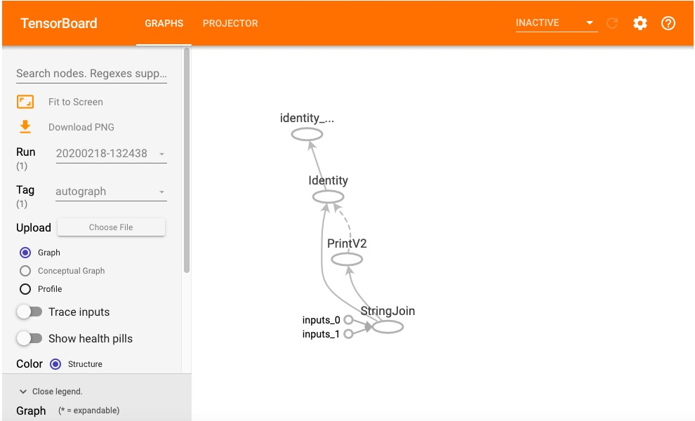

# 2-2 Three Types of Graph


There are three types of graph: static, dynamic, and Autograph.

TensorFlow 1.X used static graph, which firstly creating the graph by various operators and then open a `Session` to execute the graph.

For TensorFlow 2.X, dynamic graph is used. The operator will be added to the invisible default graph and executed instantaneously after its usage; there is no need to create a `Session`.

Using dynamic graph (i.e. Eager Execution) is convenient for debugging, as it improves performance of TensorFlow code just as original Python code, with possibilities of log output and flow control, etc.

The drawback of dynamic graph is a relatively lower execution efficiency comparing to static graph. This is because multiple times of communication between the Python thread and the C++ thread of TensorFlow Kernel is required for dynamic graph, while the static graph is executed almost all on the TensorFlow kernel using C++ code with higher efficiency. What's more, the static graph optimizes the computation, reducing the steps that are not relevant to the result.

It is possible to use the decorator `@tf.function` to construct code by converting normal Python function to TensorFlow graph. Executing this function is identical to executing `Session` in TensorFlow 1.X. This method, which uses decorator `@tf.function` to create static graph, is called Autograph.

### 1. Introduction to Graph


The graph consists of nodes and edges.

The node represent operator, while the edge represents the dependencies between the operators.

The solid edge (line) represents the dependency with data (tensor) transmission.

The dotted edge (line) represents the dependency of control, i.e. the order of execution.


### 2. The Static Graph


In TensorFlow 1.X, the static graph is impelmented in two steps: defining the graph and executing it in `Session`.

<!-- #region -->
**Example of Static Graph in TensorFlow 1.X**

```python
import tensorflow as tf

#Defining the graph
g = tf.Graph()
with g.as_default():
    #The object of the placeholder will be designated during the execution of the Session
    x = tf.placeholder(name='x', shape=[], dtype=tf.string)  
    y = tf.placeholder(name='y', shape=[], dtype=tf.string)
    z = tf.string_join([x,y],name = 'join',separator=' ')

#Executing the graph
with tf.Session(graph = g) as sess:
    print(sess.run(fetches = z,feed_dict = {x:"hello",y:"world"}))
   
```
<!-- #endregion -->

**The Static Graph in TensorFlow2.0 as a memorial**

In order to be compatible to the old versions,  TensorFlow 2.X supports the TensorFlow 1.X styled static graph in the sub-module `tf.compat.v1`.

This is just for memorial and we do NOT recommend this way.

```python
import tensorflow as tf

g = tf.compat.v1.Graph()
with g.as_default():
    x = tf.compat.v1.placeholder(name='x', shape=[], dtype=tf.string)
    y = tf.compat.v1.placeholder(name='y', shape=[], dtype=tf.string)
    z = tf.strings.join([x,y],name = "join",separator = " ")

with tf.compat.v1.Session(graph = g) as sess:
    # fetches is similar to the returning value from a function, while the placeholders in feed_dict is the input argument list to this function
    result = sess.run(fetches = z,feed_dict = {x:"hello",y:"world"})
    print(result)

```

```
b'hello world'
```


### 3. The Dynamic Graph


TensorFlow 2.X uses the dynamic graph and Autograph.

In TensorFlow 1.X, the static graph is impelmented in two steps: defining the graph and executing it in `Session`.

However, the definition and execution is no more distinguishable for dynamic graph. It executes immediatly after definition and that's the reason why it is called "Eager Excution".


```python
# The construction of the graph takes place at every operator, and the graph execution is immediately following each construction.

x = tf.constant("hello")
y = tf.constant("world")
z = tf.strings.join([x,y],separator=" ")

tf.print(z)
```

```
hello world
```

```python
# The input/output of the dynamic graph could be packaged as a function

def strjoin(x,y):
    z =  tf.strings.join([x,y],separator = " ")
    tf.print(z)
    return z

result = strjoin(tf.constant("hello"),tf.constant("world"))
print(result)
```

```
hello world
tf.Tensor(b'hello world', shape=(), dtype=string)
```


### 4. Autograph in TensorFlow 2.X


The dynamic graph has a relatively lower efficiency in execution.

We can use the decorator `@tf.function` to convert the original Python functions into the static graph as TensorFlow 1.X。

In TensorFlow 1.X, the static graph is impelmented in two steps: defining the graph and executing it in `Session`.

In TensorFlow 2.X, the two steps for Autographs are: defining the function with a decorator '@tf.function' and calling this function.

The is no need to use `Session`, so the syntax is as smooth as that of original Python.

In reality, we will debug with the dynamic graph, and shift to Autograph using decorator `@tf.function` for the code requires higher efficiency of execution.

There are certain rules of implementing `@tf.function`, which will be introduced in the following chapters.


```python
import tensorflow as tf

# Use Autograph to construct the static graph

@tf.function
def strjoin(x,y):
    z =  tf.strings.join([x,y],separator = " ")
    tf.print(z)
    return z

result = strjoin(tf.constant("hello"),tf.constant("world"))

print(result)
```

```
hello world
tf.Tensor(b'hello world', shape=(), dtype=string)
```

```python
import datetime

# Create logdir
import os
stamp = datetime.datetime.now().strftime("%Y%m%d-%H%M%S")
logdir = os.path.join('data', 'autograph', stamp)

## We recommend using pathlib under Python3
# from pathlib import Path
# stamp = datetime.datetime.now().strftime("%Y%m%d-%H%M%S")
# logdir = str(Path('../data/autograph/' + stamp))

writer = tf.summary.create_file_writer(logdir)

# Start tracing on Autograph
tf.summary.trace_on(graph=True, profiler=True) 

# Execute Autograph
result = strjoin("hello","world")

# Write the graph info into the log
with writer.as_default():
    tf.summary.trace_export(
        name="autograph",
        step=0,
        profiler_outdir=logdir)
```

```python
# Magic command to launch tensorboard in jupyter
%load_ext tensorboard
```

```python
# Launch tensorboard
%tensorboard --logdir ../data/autograph/
```



```python

```

Please leave comments in the WeChat official account "Python与算法之美" (Elegance of Python and Algorithms) if you want to communicate with the author about the content. The author will try best to reply given the limited time available.

You are also welcomed to join the group chat with the other readers through replying **加群 (join group)** in the WeChat official account.


