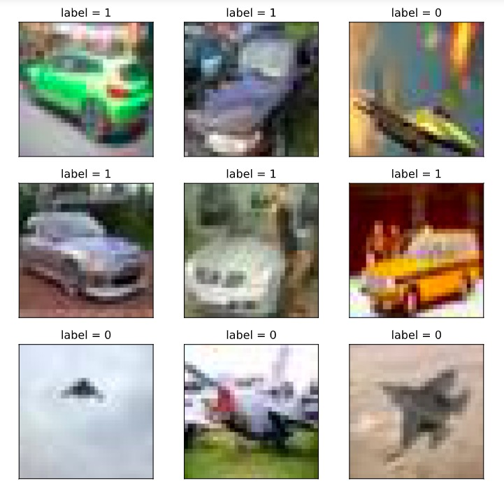

# 5-1 Dataset

All the data could be read into memory for training to maximize the efficiency, if the volume of training data is small (e.g. < 1 GB)

However, if the data volume is huge (e.g. > 10 GB) which is not possible to load everything into the memory, they should be devided into batches before reading.

The API `tf.data` constructs input data pipeline to help manage huge volume of data with various formats and conversions.

```python

```

### 1. Constructing Data Pipeline


Data pipeline could be constructed through following methods: numpy array, pandas DataFrame, Python generator, csv file, text file, file path, tfrecords file.

Among these methods, the most popular ones are: numpy array, pandas DataFrame and file path.

The drawback of using tfrecords file to construct data pipelines is its complication, since it requires: (a) construct `tf.Example` from samples; (b) compress `tf.Example` into string and write it to tfrecords file; (c) when using these data, the tfrecords file have to be read and analyzed into `tf.Example`.

On the other hand, the advantage of using tfrecords files is its small volume after compression, its convenient sharing through the Internet, and the fast speed of loading.


**1.1 Constructing Data Pipeline through Numpy Array**

```python
# Constructing Data Pipeline through Numpy Array

import tensorflow as tf
import numpy as np 
from sklearn import datasets 
iris = datasets.load_iris()


ds1 = tf.data.Dataset.from_tensor_slices((iris["data"],iris["target"]))
for features,label in ds1.take(5):
    print(features,label)

```

```
tf.Tensor([5.1 3.5 1.4 0.2], shape=(4,), dtype=float64) tf.Tensor(0, shape=(), dtype=int64)
tf.Tensor([4.9 3.  1.4 0.2], shape=(4,), dtype=float64) tf.Tensor(0, shape=(), dtype=int64)
tf.Tensor([4.7 3.2 1.3 0.2], shape=(4,), dtype=float64) tf.Tensor(0, shape=(), dtype=int64)
tf.Tensor([4.6 3.1 1.5 0.2], shape=(4,), dtype=float64) tf.Tensor(0, shape=(), dtype=int64)
tf.Tensor([5.  3.6 1.4 0.2], shape=(4,), dtype=float64) tf.Tensor(0, shape=(), dtype=int64)
```

```python

```

**1.2 Constructing Data Pipeline through Pandas DataFrame**

```python
# Constructing Data Pipeline through Pandas DataFrame
import tensorflow as tf
from sklearn import datasets 
import pandas as pd
iris = datasets.load_iris()
dfiris = pd.DataFrame(iris["data"],columns = iris.feature_names)
ds2 = tf.data.Dataset.from_tensor_slices((dfiris.to_dict("list"),iris["target"]))

for features,label in ds2.take(3):
    print(features,label)
```

```
{'sepal length (cm)': <tf.Tensor: shape=(), dtype=float32, numpy=5.1>, 'sepal width (cm)': <tf.Tensor: shape=(), dtype=float32, numpy=3.5>, 'petal length (cm)': <tf.Tensor: shape=(), dtype=float32, numpy=1.4>, 'petal width (cm)': <tf.Tensor: shape=(), dtype=float32, numpy=0.2>} tf.Tensor(0, shape=(), dtype=int64)
{'sepal length (cm)': <tf.Tensor: shape=(), dtype=float32, numpy=4.9>, 'sepal width (cm)': <tf.Tensor: shape=(), dtype=float32, numpy=3.0>, 'petal length (cm)': <tf.Tensor: shape=(), dtype=float32, numpy=1.4>, 'petal width (cm)': <tf.Tensor: shape=(), dtype=float32, numpy=0.2>} tf.Tensor(0, shape=(), dtype=int64)
{'sepal length (cm)': <tf.Tensor: shape=(), dtype=float32, numpy=4.7>, 'sepal width (cm)': <tf.Tensor: shape=(), dtype=float32, numpy=3.2>, 'petal length (cm)': <tf.Tensor: shape=(), dtype=float32, numpy=1.3>, 'petal width (cm)': <tf.Tensor: shape=(), dtype=float32, numpy=0.2>} tf.Tensor(0, shape=(), dtype=int64)
```

```python

```

```python

```

**1.3 Constructing Data Pipeline through Python generator**

```python
# Constructing Data Pipeline through Python generator
import tensorflow as tf
from matplotlib import pyplot as plt 
from tensorflow.keras.preprocessing.image import ImageDataGenerator

# Defining a generator to read image from a folder
image_generator = ImageDataGenerator(rescale=1.0/255).flow_from_directory(
                    "../data/cifar2/test/",
                    target_size=(32, 32),
                    batch_size=20,
                    class_mode='binary')

classdict = image_generator.class_indices
print(classdict)

def generator():
    for features,label in image_generator:
        yield (features,label)

ds3 = tf.data.Dataset.from_generator(generator,output_types=(tf.float32,tf.int32))
```

```python
%matplotlib inline
%config InlineBackend.figure_format = 'svg'
plt.figure(figsize=(6,6)) 
for i,(img,label) in enumerate(ds3.unbatch().take(9)):
    ax=plt.subplot(3,3,i+1)
    ax.imshow(img.numpy())
    ax.set_title("label = %d"%label)
    ax.set_xticks([])
    ax.set_yticks([]) 
plt.show()
```



```python

```

**1.4 Constructing Data Pipeline through csv file**

```python
# Constructing Data Pipeline through csv file
ds4 = tf.data.experimental.make_csv_dataset(
      file_pattern = ["../data/titanic/train.csv","../data/titanic/test.csv"],
      batch_size=3, 
      label_name="Survived",
      na_value="",
      num_epochs=1,
      ignore_errors=True)

for data,label in ds4.take(2):
    print(data,label)
```

```
OrderedDict([('PassengerId', <tf.Tensor: shape=(3,), dtype=int32, numpy=array([540,  58, 764], dtype=int32)>), ('Pclass', <tf.Tensor: shape=(3,), dtype=int32, numpy=array([1, 3, 1], dtype=int32)>), ('Name', <tf.Tensor: shape=(3,), dtype=string, numpy=
array([b'Frolicher, Miss. Hedwig Margaritha', b'Novel, Mr. Mansouer',
       b'Carter, Mrs. William Ernest (Lucile Polk)'], dtype=object)>), ('Sex', <tf.Tensor: shape=(3,), dtype=string, numpy=array([b'female', b'male', b'female'], dtype=object)>), ('Age', <tf.Tensor: shape=(3,), dtype=float32, numpy=array([22. , 28.5, 36. ], dtype=float32)>), ('SibSp', <tf.Tensor: shape=(3,), dtype=int32, numpy=array([0, 0, 1], dtype=int32)>), ('Parch', <tf.Tensor: shape=(3,), dtype=int32, numpy=array([2, 0, 2], dtype=int32)>), ('Ticket', <tf.Tensor: shape=(3,), dtype=string, numpy=array([b'13568', b'2697', b'113760'], dtype=object)>), ('Fare', <tf.Tensor: shape=(3,), dtype=float32, numpy=array([ 49.5   ,   7.2292, 120.    ], dtype=float32)>), ('Cabin', <tf.Tensor: shape=(3,), dtype=string, numpy=array([b'B39', b'', b'B96 B98'], dtype=object)>), ('Embarked', <tf.Tensor: shape=(3,), dtype=string, numpy=array([b'C', b'C', b'S'], dtype=object)>)]) tf.Tensor([1 0 1], shape=(3,), dtype=int32)
OrderedDict([('PassengerId', <tf.Tensor: shape=(3,), dtype=int32, numpy=array([845,  66, 390], dtype=int32)>), ('Pclass', <tf.Tensor: shape=(3,), dtype=int32, numpy=array([3, 3, 2], dtype=int32)>), ('Name', <tf.Tensor: shape=(3,), dtype=string, numpy=
array([b'Culumovic, Mr. Jeso', b'Moubarek, Master. Gerios',
       b'Lehmann, Miss. Bertha'], dtype=object)>), ('Sex', <tf.Tensor: shape=(3,), dtype=string, numpy=array([b'male', b'male', b'female'], dtype=object)>), ('Age', <tf.Tensor: shape=(3,), dtype=float32, numpy=array([17.,  0., 17.], dtype=float32)>), ('SibSp', <tf.Tensor: shape=(3,), dtype=int32, numpy=array([0, 1, 0], dtype=int32)>), ('Parch', <tf.Tensor: shape=(3,), dtype=int32, numpy=array([0, 1, 0], dtype=int32)>), ('Ticket', <tf.Tensor: shape=(3,), dtype=string, numpy=array([b'315090', b'2661', b'SC 1748'], dtype=object)>), ('Fare', <tf.Tensor: shape=(3,), dtype=float32, numpy=array([ 8.6625, 15.2458, 12.    ], dtype=float32)>), ('Cabin', <tf.Tensor: shape=(3,), dtype=string, numpy=array([b'', b'', b''], dtype=object)>), ('Embarked', <tf.Tensor: shape=(3,), dtype=string, numpy=array([b'S', b'C', b'C'], dtype=object)>)]) tf.Tensor([0 1 1], shape=(3,), dtype=int32)
```

```python

```

**1.5 Constructing Data Pipeline through text file**

```python
# Constructing Data Pipeline through text file

ds5 = tf.data.TextLineDataset(
    filenames = ["../data/titanic/train.csv","../data/titanic/test.csv"]
    ).skip(1) # Omitting the header on the first line

for line in ds5.take(5):
    print(line)
```

```
tf.Tensor(b'493,0,1,"Molson, Mr. Harry Markland",male,55.0,0,0,113787,30.5,C30,S', shape=(), dtype=string)
tf.Tensor(b'53,1,1,"Harper, Mrs. Henry Sleeper (Myna Haxtun)",female,49.0,1,0,PC 17572,76.7292,D33,C', shape=(), dtype=string)
tf.Tensor(b'388,1,2,"Buss, Miss. Kate",female,36.0,0,0,27849,13.0,,S', shape=(), dtype=string)
tf.Tensor(b'192,0,2,"Carbines, Mr. William",male,19.0,0,0,28424,13.0,,S', shape=(), dtype=string)
tf.Tensor(b'687,0,3,"Panula, Mr. Jaako Arnold",male,14.0,4,1,3101295,39.6875,,S', shape=(), dtype=string)
```

```python

```

**1.6 Constructing Data Pipeline through file path**

```python
ds6 = tf.data.Dataset.list_files("../data/cifar2/train/*/*.jpg")
for file in ds6.take(5):
    print(file)
```

```
tf.Tensor(b'../data/cifar2/train/automobile/1263.jpg', shape=(), dtype=string)
tf.Tensor(b'../data/cifar2/train/airplane/2837.jpg', shape=(), dtype=string)
tf.Tensor(b'../data/cifar2/train/airplane/4264.jpg', shape=(), dtype=string)
tf.Tensor(b'../data/cifar2/train/automobile/4241.jpg', shape=(), dtype=string)
tf.Tensor(b'../data/cifar2/train/automobile/192.jpg', shape=(), dtype=string)
```

```python
from matplotlib import pyplot as plt 
def load_image(img_path,size = (32,32)):
    label = 1 if tf.strings.regex_full_match(img_path,".*/automobile/.*") else 0
    img = tf.io.read_file(img_path)
    img = tf.image.decode_jpeg(img) # Note that we are using jpeg format
    img = tf.image.resize(img,size)
    return(img,label)

%matplotlib inline
%config InlineBackend.figure_format = 'svg'
for i,(img,label) in enumerate(ds6.map(load_image).take(2)):
    plt.figure(i)
    plt.imshow((img/255.0).numpy())
    plt.title("label = %d"%label)
    plt.xticks([])
    plt.yticks([])
```


```python

```

**1.7 Constructing Data Pipeline through tfrecords file**

```python
import os
import numpy as np

# inpath is the original data path; outpath: output path of the TFRecord file
def create_tfrecords(inpath,outpath): 
    writer = tf.io.TFRecordWriter(outpath)
    dirs = os.listdir(inpath)
    for index, name in enumerate(dirs):
        class_path = inpath +"/"+ name+"/"
        for img_name in os.listdir(class_path):
            img_path = class_path + img_name
            img = tf.io.read_file(img_path)
            #img = tf.image.decode_image(img)
            #img = tf.image.encode_jpeg(img) # Use jpeg format for all the compressions
            example = tf.train.Example(
               features=tf.train.Features(feature={
                    'label': tf.train.Feature(int64_list=tf.train.Int64List(value=[index])),
                    'img_raw': tf.train.Feature(bytes_list=tf.train.BytesList(value=[img.numpy()]))
               }))
            writer.write(example.SerializeToString())
    writer.close()
    
create_tfrecords("../data/cifar2/test/","../data/cifar2_test.tfrecords/")

```

```python
from matplotlib import pyplot as plt 

def parse_example(proto):
    description ={ 'img_raw' : tf.io.FixedLenFeature([], tf.string),
                   'label': tf.io.FixedLenFeature([], tf.int64)} 
    example = tf.io.parse_single_example(proto, description)
    img = tf.image.decode_jpeg(example["img_raw"])   # Note that we are using jpeg format
    img = tf.image.resize(img, (32,32))
    label = example["label"]
    return(img,label)

ds7 = tf.data.TFRecordDataset("../data/cifar2_test.tfrecords").map(parse_example).shuffle(3000)

%matplotlib inline
%config InlineBackend.figure_format = 'svg'
plt.figure(figsize=(6,6)) 
for i,(img,label) in enumerate(ds7.take(9)):
    ax=plt.subplot(3,3,i+1)
    ax.imshow((img/255.0).numpy())
    ax.set_title("label = %d"%label)
    ax.set_xticks([])
    ax.set_yticks([]) 
plt.show()

```


```python

```

```python

```

### 2. Applying Data Conversion


Dataset is very flexible in the application of data structure. Essentially it is a sequence with elements in various data types, such as tensor, list, dictionary and Dataset.

Dataset contains many functions of data conversion.

* `map`: projecting the conversion function to every element in the dataset.

* `flat_map`: projecting the conversion function to every element in the dataset, and flatten the embedded Dataset.

* `interleave`: similar as `flat_map` but interleaves the data from different sources.

* `filter`: filter certain elements.

* `zip`: zipping two Datasets with the same length.

* `concatenate`: concatenating two Datasets.

* `reduce`: executing operation of reducing.

* `batch`: constructing batches and release one batch each time; there will be one more rank comparing to the original data; the inverse operation is `unbatch`.

* `padded_batch`: constructing batches, similar as `batch`, but can achieve padded shape.

* `window`: constructing sliding window, and return Dataset of Dataset.

* `shuffle`: shuffling the order of the data.

* `repeat`: repeat the data certain times; if no argument is specified, repeat data with infinitive times.

* `shard`: sampling the elements starting from a certain position with fixed distance.

* `take`: sampling the first few elements from a certain position.


```python
#map: projecting the conversion function to every element in the dataset.

ds = tf.data.Dataset.from_tensor_slices(["hello world","hello China","hello Beijing"])
ds_map = ds.map(lambda x:tf.strings.split(x," "))
for x in ds_map:
    print(x)
```

```
tf.Tensor([b'hello' b'world'], shape=(2,), dtype=string)
tf.Tensor([b'hello' b'China'], shape=(2,), dtype=string)
tf.Tensor([b'hello' b'Beijing'], shape=(2,), dtype=string)
```

```python
#flat_map: projecting the conversion function to every element in the dataset, and flatten the embedded Dataset.

ds = tf.data.Dataset.from_tensor_slices(["hello world","hello China","hello Beijing"])
ds_flatmap = ds.flat_map(lambda x:tf.data.Dataset.from_tensor_slices(tf.strings.split(x," ")))
for x in ds_flatmap:
    print(x)
```

```
tf.Tensor(b'hello', shape=(), dtype=string)
tf.Tensor(b'world', shape=(), dtype=string)
tf.Tensor(b'hello', shape=(), dtype=string)
tf.Tensor(b'China', shape=(), dtype=string)
tf.Tensor(b'hello', shape=(), dtype=string)
tf.Tensor(b'Beijing', shape=(), dtype=string)
```

```python

```

```python
# interleave: similar as `flat_map` but interleaves the data from different sources.

ds = tf.data.Dataset.from_tensor_slices(["hello world","hello China","hello Beijing"])
ds_interleave = ds.interleave(lambda x:tf.data.Dataset.from_tensor_slices(tf.strings.split(x," ")))
for x in ds_interleave:
    print(x)
    
```

```
tf.Tensor(b'hello', shape=(), dtype=string)
tf.Tensor(b'hello', shape=(), dtype=string)
tf.Tensor(b'hello', shape=(), dtype=string)
tf.Tensor(b'world', shape=(), dtype=string)
tf.Tensor(b'China', shape=(), dtype=string)
tf.Tensor(b'Beijing', shape=(), dtype=string)
```

```python

```

```python
#filter: filter certain elements.

ds = tf.data.Dataset.from_tensor_slices(["hello world","hello China","hello Beijing"])
# Find the element with letter'a' or 'B'
ds_filter = ds.filter(lambda x: tf.strings.regex_full_match(x, ".*[a|B].*"))
for x in ds_filter:
    print(x)
    
```

```
tf.Tensor(b'hello China', shape=(), dtype=string)
tf.Tensor(b'hello Beijing', shape=(), dtype=string)
```

```python

```

```python
#zip: zipping two Datasets with the same length.

ds1 = tf.data.Dataset.range(0,3)
ds2 = tf.data.Dataset.range(3,6)
ds3 = tf.data.Dataset.range(6,9)
ds_zip = tf.data.Dataset.zip((ds1,ds2,ds3))
for x,y,z in ds_zip:
    print(x.numpy(),y.numpy(),z.numpy())

```

```
0 3 6
1 4 7
2 5 8
```

```python
#condatenate: concatenating two Datasets.

ds1 = tf.data.Dataset.range(0,3)
ds2 = tf.data.Dataset.range(3,6)
ds_concat = tf.data.Dataset.concatenate(ds1,ds2)
for x in ds_concat:
    print(x)
```

```
tf.Tensor(0, shape=(), dtype=int64)
tf.Tensor(1, shape=(), dtype=int64)
tf.Tensor(2, shape=(), dtype=int64)
tf.Tensor(3, shape=(), dtype=int64)
tf.Tensor(4, shape=(), dtype=int64)
tf.Tensor(5, shape=(), dtype=int64)
```

```python
#reduce: executing operation of reducing.

ds = tf.data.Dataset.from_tensor_slices([1,2,3,4,5.0])
result = ds.reduce(0.0,lambda x,y:tf.add(x,y))
result
```

```
<tf.Tensor: shape=(), dtype=float32, numpy=15.0>
```

```python

```

```python
#batch: constructing batches and release one batch each time; there will be one more rank comparing to the original data; the inverse operation is `unbatch`.

ds = tf.data.Dataset.range(12)
ds_batch = ds.batch(4)
for x in ds_batch:
    print(x)
```

```
tf.Tensor([0 1 2 3], shape=(4,), dtype=int64)
tf.Tensor([4 5 6 7], shape=(4,), dtype=int64)
tf.Tensor([ 8  9 10 11], shape=(4,), dtype=int64)
```

```python

```

```python
#padded_batch: constructing batches, similar as `batch`, but can achieve padded shape.

elements = [[1, 2],[3, 4, 5],[6, 7],[8]]
ds = tf.data.Dataset.from_generator(lambda: iter(elements), tf.int32)

ds_padded_batch = ds.padded_batch(2,padded_shapes = [4,])
for x in ds_padded_batch:
    print(x)    
```

```
tf.Tensor(
[[1 2 0 0]
 [3 4 5 0]], shape=(2, 4), dtype=int32)
tf.Tensor(
[[6 7 0 0]
 [8 0 0 0]], shape=(2, 4), dtype=int32)
```

```python

```

```python
#window: constructing sliding window, and return Dataset of Dataset.

ds = tf.data.Dataset.range(12)
# window returns Dataset of Dataset, which could be flattened by flat_map
ds_window = ds.window(3, shift=1).flat_map(lambda x: x.batch(3,drop_remainder=True)) 
for x in ds_window:
    print(x)
```

```
tf.Tensor([0 1 2], shape=(3,), dtype=int64)
tf.Tensor([1 2 3], shape=(3,), dtype=int64)
tf.Tensor([2 3 4], shape=(3,), dtype=int64)
tf.Tensor([3 4 5], shape=(3,), dtype=int64)
tf.Tensor([4 5 6], shape=(3,), dtype=int64)
tf.Tensor([5 6 7], shape=(3,), dtype=int64)
tf.Tensor([6 7 8], shape=(3,), dtype=int64)
tf.Tensor([7 8 9], shape=(3,), dtype=int64)
tf.Tensor([ 8  9 10], shape=(3,), dtype=int64)
tf.Tensor([ 9 10 11], shape=(3,), dtype=int64)
```

```python

```

```python
#shuffle: shuffling the order of the data.

ds = tf.data.Dataset.range(12)
ds_shuffle = ds.shuffle(buffer_size = 5)
for x in ds_shuffle:
    print(x)
    
```

```
tf.Tensor(1, shape=(), dtype=int64)
tf.Tensor(4, shape=(), dtype=int64)
tf.Tensor(0, shape=(), dtype=int64)
tf.Tensor(6, shape=(), dtype=int64)
tf.Tensor(5, shape=(), dtype=int64)
tf.Tensor(2, shape=(), dtype=int64)
tf.Tensor(7, shape=(), dtype=int64)
tf.Tensor(11, shape=(), dtype=int64)
tf.Tensor(3, shape=(), dtype=int64)
tf.Tensor(9, shape=(), dtype=int64)
tf.Tensor(10, shape=(), dtype=int64)
tf.Tensor(8, shape=(), dtype=int64)
```

```python

```

```python
#repeat: repeat the data certain times; if no argument is specified, repeat data with infinitive times.

ds = tf.data.Dataset.range(3)
ds_repeat = ds.repeat(3)
for x in ds_repeat:
    print(x)
```

```
tf.Tensor(0, shape=(), dtype=int64)
tf.Tensor(1, shape=(), dtype=int64)
tf.Tensor(2, shape=(), dtype=int64)
tf.Tensor(0, shape=(), dtype=int64)
tf.Tensor(1, shape=(), dtype=int64)
tf.Tensor(2, shape=(), dtype=int64)
tf.Tensor(0, shape=(), dtype=int64)
tf.Tensor(1, shape=(), dtype=int64)
tf.Tensor(2, shape=(), dtype=int64)
```

```python
#shard: sampling the elements starting from a certain position with fixed distance.

ds = tf.data.Dataset.range(12)
ds_shard = ds.shard(3,index = 1)

for x in ds_shard:
    print(x)
```

```
tf.Tensor(1, shape=(), dtype=int64)
tf.Tensor(4, shape=(), dtype=int64)
tf.Tensor(7, shape=(), dtype=int64)
tf.Tensor(10, shape=(), dtype=int64)
```

```python
#take: sampling the first few elements from a certain position.

ds = tf.data.Dataset.range(12)
ds_take = ds.take(3)

list(ds_take.as_numpy_iterator())

```

```
[0, 1, 2]
```

```python

```

```python

```

### 3. Enhance the Efficiency of the Pipeline


The training of deep learning model could be lengthy.

The consumed time is mainly consists of two parts: **data preparation** and **parameter iteration**.

The efficiency of parameter iteration is ususlly enhanced by GPU.

The efficiency of data preparation could be improved by constructing high-efficiency data pipeline.

Below are several suggestions of constructing high-efficiency data pipeline:

* 1, Paralleling the data preparation and the parameter iteration using method `prefetch`.

* 2, Use the method `interleave` to read data with multi-process and interleave the data from different sources.

* 3, Set `num_parallel_calls` during using `map`, allowing data conversion with multiple process.

* 4, Apply method `cache` to cache data into the memory after the first epoch for the case with a small data volume.

* 5, When converting with `map`, batch the data first, and then convert each batch with vecterization.

```python

```

**3.1 Paralleling the data preparation and the parameter iteration using method `prefetch`.**

```python
import tensorflow as tf

# Time stamp
@tf.function
def printbar():
    ts = tf.timestamp()
    today_ts = ts%(24*60*60)

    hour = tf.cast(today_ts//3600+8,tf.int32)%tf.constant(24)
    minite = tf.cast((today_ts%3600)//60,tf.int32)
    second = tf.cast(tf.floor(today_ts%60),tf.int32)
    
    def timeformat(m):
        if tf.strings.length(tf.strings.format("{}",m))==1:
            return(tf.strings.format("0{}",m))
        else:
            return(tf.strings.format("{}",m))
    
    timestring = tf.strings.join([timeformat(hour),timeformat(minite),
                timeformat(second)],separator = ":")
    tf.print("=========="*8,end = "")
    tf.print(timestring)
    
```

```python
import time

# Data preparation and parameter iteration is serial as default.

# Simulation of data preparation
def generator():
    for i in range(10):
        # Suppose we need 2 seconds for each preparation
        time.sleep(2) 
        yield i 
ds = tf.data.Dataset.from_generator(generator,output_types = (tf.int32))

# Simulation of parameter iteration
def train_step():
    # Suppose we need 1 seconds for each training step
    time.sleep(1) 
    
```

```python
# Estimated time of training: 10*2+10*1 = 30s
printbar()
tf.print(tf.constant("start training..."))
for x in ds:
    train_step()  
printbar()
tf.print(tf.constant("end training..."))
```

```python
# Use method prefetch to parallel the processes of data preparation and parameter iteration.

# Estimated time of training:  max(10*2,10*1) = 20s
printbar()
tf.print(tf.constant("start training with prefetch..."))

# tf.data.experimental.AUTOTUNE allows auto-selection of parameters
for x in ds.prefetch(buffer_size = tf.data.experimental.AUTOTUNE):
    train_step()  
    
printbar()
tf.print(tf.constant("end training..."))

```

```python

```

**3.2 Use the method `interleave` to read data with multi-process and interleave the data from different sources.**

```python
ds_files = tf.data.Dataset.list_files("../data/titanic/*.csv")
ds = ds_files.flat_map(lambda x:tf.data.TextLineDataset(x).skip(1))
for line in ds.take(4):
    print(line)
```

```
tf.Tensor(b'493,0,1,"Molson, Mr. Harry Markland",male,55.0,0,0,113787,30.5,C30,S', shape=(), dtype=string)
tf.Tensor(b'53,1,1,"Harper, Mrs. Henry Sleeper (Myna Haxtun)",female,49.0,1,0,PC 17572,76.7292,D33,C', shape=(), dtype=string)
tf.Tensor(b'388,1,2,"Buss, Miss. Kate",female,36.0,0,0,27849,13.0,,S', shape=(), dtype=string)
tf.Tensor(b'192,0,2,"Carbines, Mr. William",male,19.0,0,0,28424,13.0,,S', shape=(), dtype=string)
```

```python
ds_files = tf.data.Dataset.list_files("../data/titanic/*.csv")
ds = ds_files.interleave(lambda x:tf.data.TextLineDataset(x).skip(1))
for line in ds.take(8):
    print(line)
```

```
tf.Tensor(b'181,0,3,"Sage, Miss. Constance Gladys",female,,8,2,CA. 2343,69.55,,S', shape=(), dtype=string)
tf.Tensor(b'493,0,1,"Molson, Mr. Harry Markland",male,55.0,0,0,113787,30.5,C30,S', shape=(), dtype=string)
tf.Tensor(b'405,0,3,"Oreskovic, Miss. Marija",female,20.0,0,0,315096,8.6625,,S', shape=(), dtype=string)
tf.Tensor(b'53,1,1,"Harper, Mrs. Henry Sleeper (Myna Haxtun)",female,49.0,1,0,PC 17572,76.7292,D33,C', shape=(), dtype=string)
tf.Tensor(b'635,0,3,"Skoog, Miss. Mabel",female,9.0,3,2,347088,27.9,,S', shape=(), dtype=string)
tf.Tensor(b'388,1,2,"Buss, Miss. Kate",female,36.0,0,0,27849,13.0,,S', shape=(), dtype=string)
tf.Tensor(b'701,1,1,"Astor, Mrs. John Jacob (Madeleine Talmadge Force)",female,18.0,1,0,PC 17757,227.525,C62 C64,C', shape=(), dtype=string)
tf.Tensor(b'192,0,2,"Carbines, Mr. William",male,19.0,0,0,28424,13.0,,S', shape=(), dtype=string)
```

```python

```

**3.3 Set `num_parallel_calls` during using `map`, allowing data conversion with multiple process.**

```python
ds = tf.data.Dataset.list_files("../data/cifar2/train/*/*.jpg")
def load_image(img_path,size = (32,32)):
    label = 1 if tf.strings.regex_full_match(img_path,".*/automobile/.*") else 0
    img = tf.io.read_file(img_path)
    img = tf.image.decode_jpeg(img) #Note: jpeg format here
    img = tf.image.resize(img,size)
    return(img,label)
```

```python
# Conversion with single process
printbar()
tf.print(tf.constant("start transformation..."))

ds_map = ds.map(load_image)
for _ in ds_map:
    pass

printbar()
tf.print(tf.constant("end transformation..."))
```

```python
# Conversion with multi-process
printbar()
tf.print(tf.constant("start parallel transformation..."))

ds_map_parallel = ds.map(load_image,num_parallel_calls = tf.data.experimental.AUTOTUNE)
for _ in ds_map_parallel:
    pass

printbar()
tf.print(tf.constant("end parallel transformation..."))
```

```python

```

**3.4 Apply method `cache` to cache data into the memory after the first epoch for the case with a small data volume.**

```python
import time

# Simulation of data preparation
def generator():
    for i in range(5):
        # Suppose we need 2 seconds for each preparation
        time.sleep(2) 
        yield i 
ds = tf.data.Dataset.from_generator(generator,output_types = (tf.int32))

# Simulation of parameter iteration模拟参数迭代
def train_step():
    # Suppose we need 1 second for each training step
    pass

# Estimated time for training: (5*2+5*0)*3 = 30s
printbar()
tf.print(tf.constant("start training..."))
for epoch in tf.range(3):
    for x in ds:
        train_step()  
    printbar()
    tf.print("epoch =",epoch," ended")
printbar()
tf.print(tf.constant("end training..."))

```

```python
import time

# Simulation of data preparation
def generator():
    for i in range(5):
        # Suppose we need 2 seconds for each preparation
        time.sleep(2) 
        yield i 

# Use the method "cache" to cache the data into the memory, only for dataset with small volume.
ds = tf.data.Dataset.from_generator(generator,output_types = (tf.int32)).cache()

# Simulation of parameter iteration
def train_step():
    # Suppose each training step needs 0 second
    time.sleep(0) 

# Estimated time for training: (5*2+5*0)+(5*0+5*0)*2 = 10s
printbar()
tf.print(tf.constant("start training..."))
for epoch in tf.range(3):
    for x in ds:
        train_step()  
    printbar()
    tf.print("epoch =",epoch," ended")
printbar()
tf.print(tf.constant("end training..."))
```

```python

```

**3.5 When converting with `map`, batch the data first, and then convert each batch with vecterization.**

```python
# Map first, then batch
ds = tf.data.Dataset.range(100000)
ds_map_batch = ds.map(lambda x:x**2).batch(20)

printbar()
tf.print(tf.constant("start scalar transformation..."))
for x in ds_map_batch:
    pass
printbar()
tf.print(tf.constant("end scalar transformation..."))

```

```python
# Batch first, then map
ds = tf.data.Dataset.range(100000)
ds_batch_map = ds.batch(20).map(lambda x:x**2)

printbar()
tf.print(tf.constant("start vector transformation..."))
for x in ds_batch_map:
    pass
printbar()
tf.print(tf.constant("end vector transformation..."))

```

```python

```

Please leave comments in the WeChat official account "Python与算法之美" (Elegance of Python and Algorithms) if you want to communicate with the author about the content. The author will try best to reply given the limited time available.

You are also welcomed to join the group chat with the other readers through replying **加群 (join group)** in the WeChat official account.


```python

```
