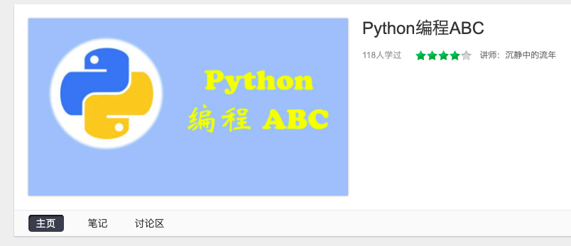
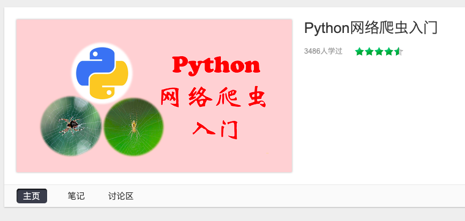
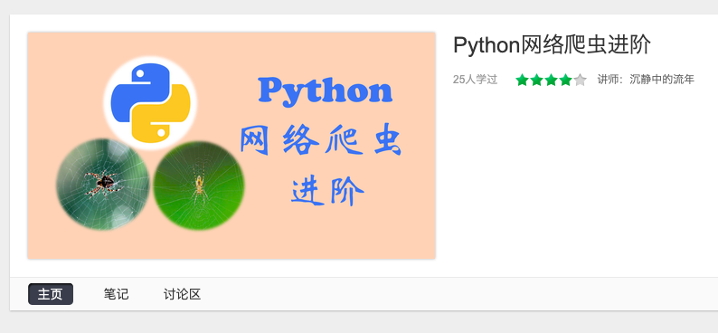
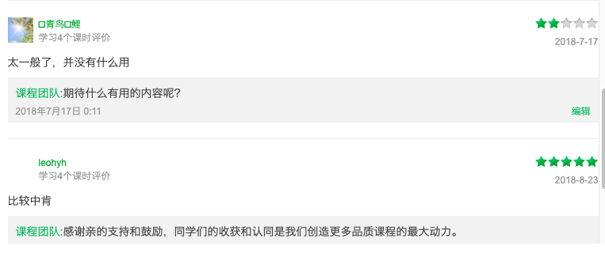
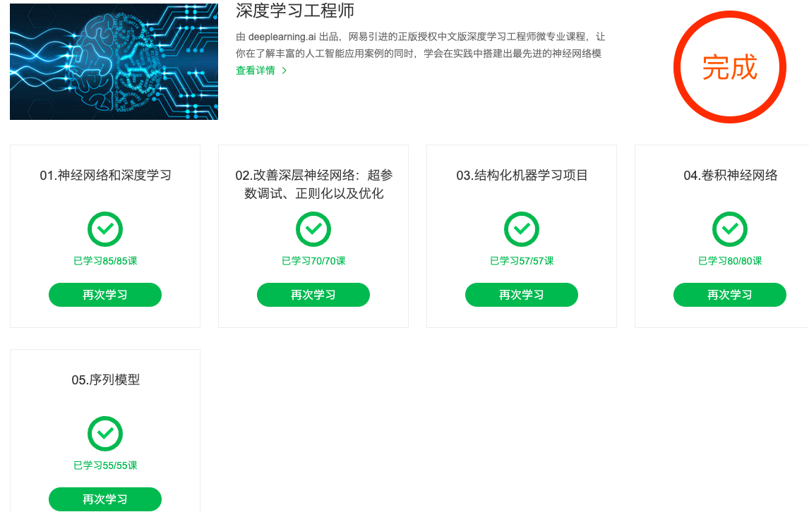
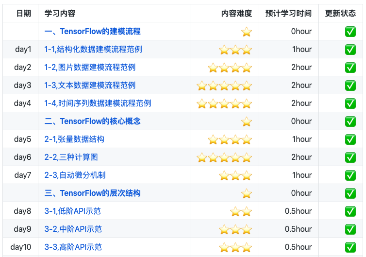
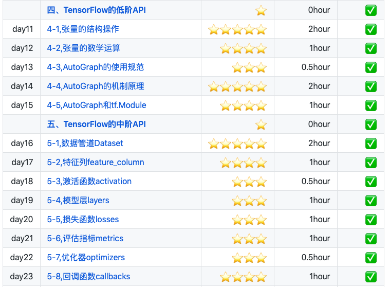
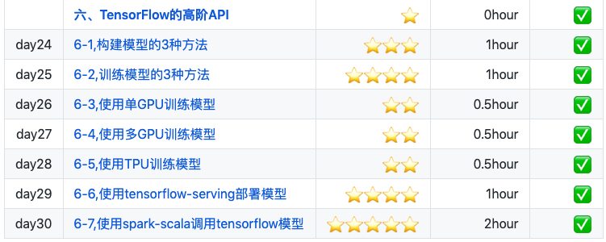
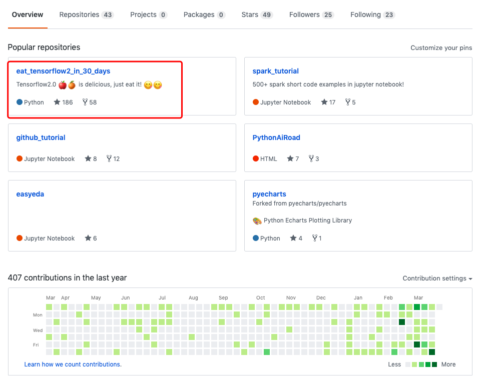
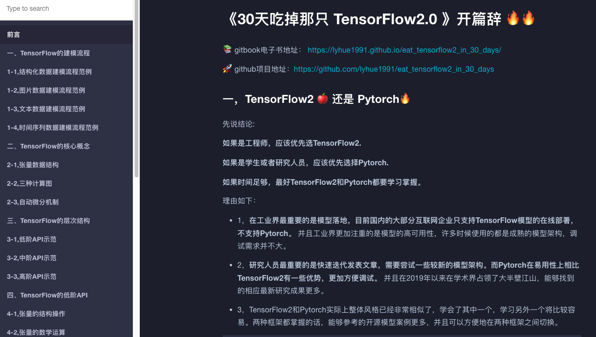

# 一个吃货和一道菜的故事

《30天吃掉那只TensorFlow2》这本书已经全部整理完稿。本篇文章算是这本书的一个后记。

本文介绍了一个吃货与算法结缘的故事，并介绍了本书的写作过程。可供感兴趣的读者一乐。

如果读者时间紧迫，可直接阅读本文第3部分和第4部分，了解书籍内容和获取方法。

### 一，一个吃货转行算法的心路历程

2015年6月，又是一个毕业季，一个吃货从北京吃饭大学毕业了。

虽然是吃饭大学毕业，但他学的是理论物理，而理论物理不是一个适合找饭吃的专业。

几经辗转，这个吃货在金融行业找到了一份量化程序员的工作，虽然收入低微，但是这个吃货梦想有一天可以找到能够稳定盈利的量化策略，通过交易赚钱让自己能够每天都有口好吃的。

然而，资本市场波谲云诡，他尝试过许多交易策略，却没有找到能够稳定赚钱的"圣杯"，伙食也一天比一天变差了。

在与K线的纠缠中，他慢慢地迷失了，虽然他知道每次亏钱都是靠实力输的，但是他不知道自己每次赚钱是凭借实力赚的还是凭运气赚的。他感到在金融交易这个行业很难清晰地看到自己的进步。

付出了那么多的努力，搞了那么多模型，写了那么多策略，自己就真的有成长吗？在残酷的交易世界里，这些东西不能赚钱，不能够改善自己的伙食，又有什么价值呢？

作为一个吃货，他无法忍受伙食变得越来越差。他决定换一个能够稳定地让伙食变得更好的行业。

那个时候，随着AlphaGo战胜世界围棋冠军李世石的故事广为人知，在互联网领域有一个新兴岗位逐渐火热，那就是算法工程师。

这个吃货心想，我也是做模型的，算法工程师也是做模型的，怎么伙食差别这么大，不行我要转行做算法工程师。

然后吃货就开始准备了。吃货性格内向，不擅言谈，交际圈较小，身边没有认识做算法工程师的朋友。

于是吃货从一些招聘网站上浏览了一些算法工程师的招聘信息，又在知乎等平台上浏览了一些关于转行算法工程师的相关帖子。

他给自己制定了一个为期半年左右的学习计划。学习顺序大概如下：

* 1，Python编程
* 2，Numpy,Pandas,matplotlib数据分析
* 3，beautifulSoup,requests网络爬虫 
* 4，sklearn机器学习（同步学习《机器学习实战》，李航《统计学习方法》）
* 5，tensorflow深度学习（同步学习吴恩达的《深度学习》视频课程）

他决定第4阶段学的差不多就去找算法工程师的工作。

（PS：实践表明，这个学习计划的第3部分是可以去除的。算法工程师通常不需要掌握爬虫技术，算法工程师训练模型所需要的数据一般来自于公司业务，直接从数据库中获取即可。）

为了确保自己能够真正地学会，并能够清晰地看到自己的成长。这个吃货决定要让自己的学习留下点痕迹。

同时，他又想，能不能在学习的同时改善一下自己的伙食呢？思来想去，最后他找到了一个方法，那就是每学完一个部分，就录制一个视频课程拿到网易云课堂上去卖。看能不能每个月多个三块五块的，以便改善一下伙食。

**一个吃货，一旦决定为了改善自己的伙食想要做点什么，他的意志力是惊人的。**

于是，大概有半年左右，这个吃货每天晚上和周末的时间都几乎花在了这几个课程的学习和输出上。网易云课堂上陆陆续续多了这个吃货的以下5门课程。

**第一门课程：《Python编程ABC》**

吃货本来做量化交易掌握了一些Python编程基础，但不是很熟练，学习加整理这个课程大概花了半个月。

考虑到自身水平有限，吃货怕没有一个人买，不敢卖高价，因此该课程标价1元，上线2年多，总共卖出108份。

算下来还是不错的，每个月多个三块钱伙食费的理想还是基本实现了的，离五块钱还差一些。

该课程尽管买的人不多，还是有几个评价的。

**第二门课程：《Python数据分析》**

Python数据分析的3个标准套件：numpy,Pandas,matplotlib 掌握起来还是需要下点功夫的。

吃货学习这几个库和整理最终的课程大概花了一个半月。考虑到这门课程做了比较久的时间，同时吃货感到自己的水平有了那么一丢丢进步了，Pandas玩的基本666的了，吃货决定这门课卖10块钱一份，看看能不能每个月多个5块10块的。

这门课程上线2年多，总共卖出去35份。看来每个月多个10块的目标也是基本实现了的。这门课由于买的人非常少，所以目前还没有收到过评价。关起门来说，这门课的质量只能算是让人不忍心给差评吧。

**第三门课程：《Python网络爬虫入门》**

**第四门课程：《Python网络爬虫进阶》**

Python网络爬虫的基础还是不难的，但如果要熟练掌握各种反爬策略的突破以及对动态网页的抓取还是非常有挑战性的，

Python爬虫的学习以及这两门课程的制作大概花费了吃货2个月的时间。

其中的网络爬虫入门课程是免费课程，网络爬虫进阶课程售价30元。

网络爬虫入门课程收获了不少好评，虽然没有赚到一毛钱，不能直接改善伙食，但吃货看了这些好评，感觉比吃了蜜还要甜。

**第五门课程：《sklearn机器学习》**

在做这门课程的时候，吃货同步学习了《机器学习实战》和《统计学习方法》的一些章节。包括学习和输出，大概花了吃货2个月左右时间。

整体上，sklearn的基础使用和机器学习的基本概念的掌握还是不困难的。决策树和SVM的一些原理可能坑会比较多，需要花费较多时间梳理。

吃货的这门课程售价68元，整体上评价较高，达到4.7颗星。

实际上这门课程做到一半的时候，吃货决定裸辞，因为那时候大概是2018年3月份了，是招聘的黄金时期。经过了半年多的准备，吃货信心满满，感觉已经掌握了从Python基础到Python数据分析到Python机器学习的基本技能，应该能够摸到算法工程师的工作机会。

吃货开始在Boss上和拉勾上投递简历，那时候正是算法岗需求most火爆的时期，吃货陆陆续续收到了一些二三线互联网公司的面试邀约。但陆续面了好几场，吃货发现自己总是会遇到一些如手写二分查找，手写快排算法，手写爬楼梯方法这样的问题。拿到这些问题后吃货一脸懵逼，在纸上抓破脑袋写下了几行import numpy as np,import pandas as pd 这样的东西，然后面试官就笑盈盈地跟吃货说，你回去等通知吧。

于是，吃货一边白天面试，一边晚上回家整理白天遇到的这些问题，并重点针对一些常见的手写代码题进行了准备，掌握了一些像时间复杂度和动态规划这样基本的数据结构和算法知识。周末的时候，再继续录制《sklearn机器学习》这个课程。这样大概持续了半个多月，吃货开始收到一些offer. 很快，吃货跟一个offer确认了眼神，正式转行成为了一个互联网行业的搬砖工，伙食相比以前有了较大的改善，吃货的心里乐开了花。

吃货后来在周末的时候也把这些面试的经验总结起来，放在了网易云课堂上。

这个课程的评价比较两级分化，有人叫好，也有人吐槽说木有什么卵用。

### 二，吃货为什么要写这本书？

成为了一名互联网搬砖工后，吃货本想着在周末时间，把自己转行之前制定的学习计划的第5部分，即tensorflow深度学习（同步学习吴恩达的《深度学习》视频课程）这部分付诸实施。

但搬砖工作非常辛苦，同时工作还需要吃货掌握一些其它的技能，例如linux基本操作，git基本操作，Hive数据库，mapreduce编程方法，xgboost和lightgbm建模方法等等。

大概半年后，吃货才感到已经熟练掌握了当时工作所需要的主要技能，能够较为顺利地开发项目。到了周末的时候，吃货开始一边在网易云课堂上看吴恩达《深度学习》视频课程，一边学习使用tensorflow.

吴恩达的这个系列的课程总体上非常不错，但略微偏理论一些，讲了较多的数学细节，吃货当时学的还是有些吃力的。大概用了半年的周末时间，才基本学习完成了这五门课，并梳理出来了5篇学习笔记。

后来吃货向"Python之禅"公众号投稿了一篇文章《18式优雅你的Python》，号主志军大大在后来做抽奖送书的活动时就送了吃货一本书《Python深度学习》。这本书相比于吴恩达课程更加基础一些，该书假定读者无任何机器学习知识，以Keras为工具，使用丰富的范例演示深度学习的最佳实践。该书通俗易懂，全书没有一个数学公式，注重培养读者的深度学习直觉。吃货拿来该书，简直如获至宝，不到两个周末就吃完了，对深度学习在实践层面有了更为清晰的认识。

同时，吃货还在学习tensorflow1.0，总体而言学得比较痛苦，官方文档讲的各种概念多而杂，静态图非常难以调试，tf.control_dependencies, tf.while_loop这些东西简直反人类，又是tf.estimator, 又是tflearn, 又是tf.keras，让人无所适从。吃货花费了非常多的时间，基本上才把tensorflow1.0常用的一些概念和工具梳理到一个适合人类理解的程度。

但tensorflow不仁，以吃货为刍狗。就在吃货快要整理完这个tensorflow1.0教程的时候，tensorflow官方宣布将不久推出tensorflow2.0，默认使用动态图，并对API进行大幅度的调整。吃货当时心里的滋味，就好像一个男孩子追一个女生追了大半年，感觉基本摸清楚了这个女生的脾气和个性的时候，这个女生突然有一天对他说："你别追了，我要去做变性手术了，变成一个男孩子。"

于是，吃货转而开始学习Spark，整体而言，Spark的官方教程非常完善，网络上也有比较好的教程资源。吃货学起来非常顺利，不到2个月，就学习并整理了一份系统的Spark教程，放在了github仓库中。

2019年10月1日，这是一个特别的日子。这一天既是祖国母亲的生日，也是tensorflow2.0的生日。在这一天tensorflow官方宣布发布tensorflow2.0的正式版本。吃货知道这个消息后非常开心，就好像一个花痴终于等到了花开一样。但是吃货当时正在做一个他搬砖以来遇到过的最复杂的一个spark大数据挖掘项目，周末的时间都投入到这个项目的攻坚中去了。吃货决定等这个项目基本完成后，重新学习并梳理一份tensorflow2的教程。

大概在2020年初，吃货开始学习tensorflow2.0的官方文档。尽管tensorflow2.0宣称已经为改善用户体验做出了巨大的改进，really easy to use，但吃货学得并不轻松。tensorflow2.0官方文档和tensorflow1.0官方文档显然是出自同一批作者之手，他们一如既往地秉承着谷歌make things complicated的风格传统，用哈希表一般混乱的文档结构、无法运行的范例代码、复杂的函数嵌套调用关系、随意插入的不常用第三方库等技巧将读者的懵圈程度逐步推向高潮。

在吃货看来，tensorflow2.0官方文档所有的问题可以抽象为一个问题：噪声太多。读者要从噪声如此之多的官方教程中提取出他想要的信息是非常的吃力的。如果把官方教程比作一盘菜，那么这盘菜虽然有许多营养物质，但也有许多的沙子，不小心咬到一口就硌得慌，甚至会觉得恶心得不行。吃货决定要做一盘营养丰富，且美味宜人的菜。

吃货开始按照他想象中美味佳肴的样子来做这盘菜。周末本应适合去参加户外爬山活动，他对着电脑在做菜。放假回家的火车上，他对着电脑在做菜。春节到家后由于疫情影响不提倡窜门，他可以有更多时间开心地对着电脑做菜。疫情形势愈发严峻企业延迟复工，他回到北京一边隔离一边对着电脑在做菜。

### 三，吃货写的这本书怎么样？

前后用了约两个月，吃货的这本书基本写完了。吃货心想，该给它取个什么名字呢？

嗯，有了，这是一本可以帮助大家改善伙食的书。大概可以连续吃30天，而且应该味道不错。

就叫他《30天吃掉那只TensorFlow2》吧。

从这本书的书名应该能够看出，作者是个吃货，而且是个很有毅力的吃货。

这是一本怎么样的书呢？这是一本对人类用户极其友善的TensorFlow2.0入门工具书。

为了尽可能降低信息噪声，这本书相比官方文档在篇章结构和范例选取上做了大量的优化。

不同于官方文档混乱的篇章结构，既有教程又有指南，缺少整体的编排逻辑。

这本书按照内容难易程度、读者检索习惯和TensorFlow自身的层次结构设计内容，循序渐进，层次清晰，方便按照功能查找相应范例。

不同于官方文档冗长的范例代码，这本书在范例设计上尽可能简约化和结构化，增强范例易读性和通用性，大部分代码片段在实践中可即取即用。

总之，这本书倾注了一个吃货对美食的全部向往和追求，如果你非常喜欢美食，并且想要学习TensorFlow2，那么这本书一定值得你品尝品尝。

这本书在github上线1个月来，得到了不少小伙伴的反馈，提了一些issues，吃货针对相关问题进行了一些回答和对项目做了改进。

同时这个项目也获得了100多颗星星，吃货看在眼里，美在心里，每天早上睡觉起来都会去github星球上数星星。

### 四，如何获取吃货写的这本书?

这本书目前有4种形式获取。

1，gitbook电子书。以网页链接呈现，同时可以在电脑和手机上用浏览器打开。

电子书链接： https://lyhue1991.github.io/eat_tensorflow2_in_30_days

2，github项目源码。包含全部数据集和md格式源码，可以在jupyter上安装jupytext后将md源码作为ipynb打开。

项目链接：https://github.com/lyhue1991/eat_tensorflow2_in_30_days

3，pdf格式电子书。

4，ipynb格式项目源码。

其中github项目源码和gitbook电子书将持续维护，后续可能也会增加一些新的范例。pdf版本电子书和ipynb项目源码可以在公众号"**Python与算法之美**"后台回复关键字: **tf** 进行获取。这两种形式获取的《eat tensorflow2 in 30 days》无法保证更新。

阅读体验优先推荐使用gitbook电子书，具有目录查找和上下页翻页功能，字体大小和背景色可以根据个人喜好进行调整，颜值超高。

### 五，鼓励和联系这个吃货

最后，想给大家讲一个吃货小王子的故事。

>在很久很久以前，有一个小王子，住在一个只比他大一点点的星球上，他，想要一个朋友。

>在昨天今天和明天，有一个吃货，住在一个只比他大一点点的github星球上，他，想要一颗星星。

如果对这本书内容理解上有需要进一步和吃货交流的地方，可以在公众号"Python与算法之美"下留言。吃货时间和精力有限，会酌情予以回复。

